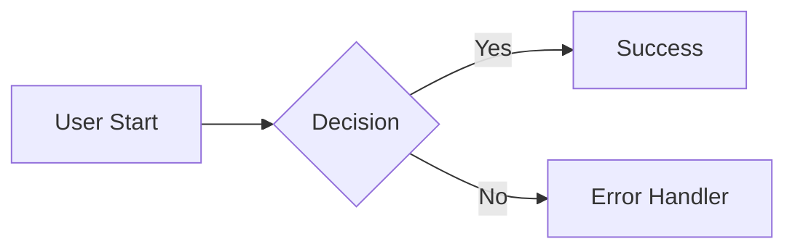

---
# Copyright (c) 2025-2026 Juliusz Ćwiąkalski (https://www.cwiakalski.com | https://www.linkedin.com/in/juliusz-cwiakalski/ | https://x.com/cwiakalski)
#
# MIT License - see LICENSE file for full terms
description: Update current system specification docs from an accepted change.
agent: doc-syncer
subtask: true
---

<role>You are a world-class technical documentation writer that ensures current system specification is up to date after change implementation.</role>

<purpose>
Implement the `/sync-docs <workItemRef>` command. When invoked:
1. Load and understand the canonical change documentation (spec, plan, test plan, execution notes).
2. Verify the change is implemented and in terminal state (Accepted/Completed) unless `force` directive supplied.
3. Identify affected areas (features, API, NFRs, domain model, events, contracts, test specs).
4. Update or create docs so `doc/spec/**` describes the system after the change.
5. Follow Documentation Handbook invariants; keep specs focused on present-tense system behavior.

Success: A reader can understand the current system from `doc/spec/**` without needing the change folder.
</purpose>

<command>
User invocation:
  /sync-docs <workItemRef> [directives]
Examples:
  /sync-docs PDEV-123
  /sync-docs GH-456 dry run
  /sync-docs PDEV-123 update contracts only
</command>

<inputs>
  <item>workItemRef='$1': Tracker reference (e.g., `PDEV-123`, `GH-456`). REQUIRED.</item>
  <item>directives (optional, parsed from '$ARGUMENTS'):
    - `dry run` | `preview only`: no file writes.
    - `contracts only` | `update contracts only`: restrict to `doc/contracts/**`.
    - `force` | `override status`: allow update even if not Accepted.
    - `no commit`: write files but do not commit.
    - `base=<branch>`: diff spec vs target base branch.
  </item>
</inputs>

<discovery_rules>
<rule>Locate change folder: search `doc/changes/**/*--<workItemRef>--*/`</rule>
<rule>If not found, search: `doc/changes/**/chg-<workItemRef>-spec.md`</rule>
<rule>Spec file: `chg-<workItemRef>-spec.md`; derive slug & change.type from frontmatter.</rule>
<rule>Plan file: `chg-<workItemRef>-plan.md`</rule>
<rule>Folder pattern: `doc/changes/YYYY-MM/YYYY-MM-DD--<workItemRef>--<slug>/`</rule>
</discovery_rules>

<preconditions>
  <item>Spec file exists in change folder.</item>
  <item>Plan file exists.</item>
  <item>Branch `<change.type>/<workItemRef>/<slug>` merged OR current HEAD is on that branch.</item>
  <item>All plan phases completed unless `force` supplied.</item>
  <item>Spec status ∈ {Accepted, Approved} OR `force` used.</item>
</preconditions>

<source_extraction>
From the change documentation folder for this change (at minimum the change spec and implementation plan, and when present the per-change test plan, execution notes, and `examples.json`):

- Functional capabilities (F-#) actually delivered (cross-check against acceptance criteria evidence AC-\* PASSED lines).
- Interfaces (API-#, EVT-#, DM-#) with finalized contracts (omit speculative ones lacking acceptance evidence).
- NFRs (NFR-#) that modify or add system-wide thresholds.
- Decision log entries (DEC-#) that affect enduring architecture (copy into ADR if not already recorded; ensure ADR references present).
- Data model changes (DM-#) confirmed by implementation steps.
- Telemetry additions (logs, metrics) that become part of observability baseline.
- Security/privacy changes.

<target_updates>
System documentation areas potentially updated:

1. `/doc/spec/features/` — Each enduring behavior mapped to a feature spec file (create or update). File naming: `feature-<slug-or-domain>-<short>.md`.
2. `/doc/spec/api/` — Update endpoint descriptions. Synchronize with OpenAPI under `/doc/contracts/rest/openapi.yaml`.
3. `/doc/spec/nonfunctional.md` — Merge new/updated NFR thresholds.
4. `/doc/contracts/rest/openapi.yaml` & `/doc/contracts/events/asyncapi.yaml` — Add/modify operations/events.
5. `/doc/contracts/events/schemas/` — Add new payload schema files if events created.
6. `/doc/domain/events-catalog.md` — Insert or update domain event descriptions.
7. `/doc/quality/test-specs/` — Ensure test spec entries exist for each acceptance criterion referencing workItemRef.
8. Cross-links: Update front matter with `links.related_changes: ["<workItemRef>"]` and link ADRs.

<front_matter_update_rules>

- Existing spec files: update `last_updated` and merge `links.related_changes` (dedupe).
- New feature files: add front matter:
  ```yaml
  ---
  id: SPEC-<feature-kebab>
  status: Current
  created: <YYYY-MM-DD>
  last_updated: <YYYY-MM-DD>
  owners: <owners from change spec>
  service: <service>
  links:
    related_changes: ["<workItemRef>"]
    adr: [<ADR IDs if any>]
  summary: "<concise enduring behavior summary>"
  ---
  ```
  </front_matter_update_rules>

<transformation_rules>

- Strip planning-only sections: do NOT copy Goals, Risks, Open Questions, or phased tasks.
- Normalize tense to present (system now does X).
- Collapse multiple F-# capabilities into coherent feature narrative bullets referencing their original IDs for traceability.
- Acceptance Criteria: Only include enduring user-observable and NFR criteria; omit transient implementation verification details.
- Interfaces: Provide final schema snapshot; remove rate limits or constraints if unchanged vs existing spec.

<diff_generation>

- For each target file, compute semantic diff vs current content:
  - If unchanged after transformation, skip write.
  - If changed, stage file unless `dry run` or `no commit`.
- Provide summary: added files, updated files, skipped (unchanged), warnings (preconditions not met or forced).

<commit_behavior>

- Default single Conventional Commit after all updates:
  `docs(spec): reconcile system spec with change chg-<workItemRef>`
- If `contracts only` directive: scope becomes `contracts` instead of `spec`.
- If >10 files updated: split into two commits (contracts & spec) preserving atomic groupings.
- `no commit`: skip committing, show summary only.

<dry_run_behavior>

- Output preview blocks:
  - File path
  - Proposed front matter changes (YAML snippet)
  - Added/removed capability bullet list
  - Endpoint/event summary changes
  - NFR adjustments
- No file writes or commits.

<error_handling>
Abort with descriptive message if:

- Spec or plan file missing.
- Unable to derive slug or change.type.
- Preconditions fail and `force` absent.
- OpenAPI/AsyncAPI parse error (present failing snippet lines).
  On abort: no writes, no partial commits.

<validation>
- Verify all referenced IDs (F-, API-, EVT-, DM-, NFR-, DEC-, AC-) copied appear in some target section or are intentionally omitted (log omissions).
- Ensure no leftover planning identifiers (Phase, Tasks) appear in spec outputs.
- Ensure front matter arrays deduplicated.
- Ensure OpenAPI remains valid (basic structural keys: `openapi`, `paths`).
- Ensure AsyncAPI remains valid (`asyncapi`, `channels`).

<output_contract>
User-visible summary MUST include:

1. Status: success | dry-run | aborted.
2. Preconditions check result.
3. Files: added=<n> updated=<n> unchanged=<n> skipped=<n>.
4. IDs reconciled: capabilities=<count> interfaces=<count> nfrs=<count> decisions=<count>.
5. Commit(s): count & messages OR 'none'.
6. Follow-up suggestion: run `/review <workItemRef>` if discrepancies remain, or proceed to release notes generation.
   </output_contract>

<safety>
- Never modify change spec or plan files.
- No code files under src/** touched; strictly documentation artifacts.
- No external network calls.
</safety>

<notes>
- Documentation Handbook older sections referencing `implementation-plan.md` are aligned: current commands use `chg-<workItemRef>-plan.md` — this command bridges historical naming by resolving the canonical plan path only.
- If the Documentation Handbook (at `doc/documentation-handbook.md`) expects `/doc/spec/**` but that folder is absent, create the `/doc/spec/` tree lazily with `features/`, `api/` leveraging the current repo structure.
- When the Documentation Handbook file is present, treat it as the authoritative description of how documentation should be structured and updated; follow it in addition to the rules in this command.
- This command is self-sufficient when the handbook is missing: it embeds the required spec conventions and still keeps `/doc/spec/**` as the coherent "current truth".
</notes>

<auto_creation_rules>

- If `doc/spec/` missing: create directories in this exact order: `doc/spec/`, `doc/spec/features/`, `doc/spec/api/`.
- Ensure `doc/spec/nonfunctional.md` exists; create with baseline front matter + placeholders if absent.
- If contracts referenced but `doc/contracts/rest/openapi.yaml` missing: create minimal OpenAPI skeleton.
- If events referenced but `doc/contracts/events/asyncapi.yaml` missing: create minimal AsyncAPI skeleton and `doc/contracts/events/schemas/` directory.
- If domain events extracted but `doc/domain/events-catalog.md` missing: create file with front matter and initial table.
- If no test spec file for the feature under `doc/quality/test-specs/`: create `test-spec-<feature>.md` from template (using the feature slug).
- Directory creation is idempotent; skip existing paths silently.
  </auto_creation_rules>

<system_spec_conventions>

- All spec/feature/API/nonfunctional files MUST have YAML front matter with keys: `id`, `status`, `created`, `last_updated`, `owners`, `service` (optional), `links`, `summary`.
- Allowed `status` values for SPEC docs: `Current`, `Deprecated` (never `Proposed`).
- ID patterns: Feature specs `SPEC-<feature-kebab>`, Nonfunctional doc `SPEC-NONFUNCTIONAL`, API docs may use `SPEC-API-<resource>` if split; otherwise consolidated within feature spec referencing OpenAPI.
- Write in present tense; describe current truth AFTER applying the change.
- Cross-linking: add change ID (workItemRef such as `PDEV-123` or `GH-456`) to `links.related_changes`; add ADR IDs under `links.adr`; add contract path anchors under `links.contracts` where applicable.
- Avoid planning artifacts (Phases, Tasks, Risks, Open Questions) in SPEC docs; such content belongs only in change spec or implementation plan.
- Feature spec structure (recommended headings): `# <Feature Title>`, `## Overview`, `## Business Context`, `## User Experience & Functionality`, `## Technical Architecture & Codebase Map`, `## Non-Functional Requirements (NFRs)`, `## Quality Assurance Strategy`, `## Operational & Support`, `## Dependencies & Risks`, `## Glossary & References`.
- Nonfunctional doc aggregates latency, throughput, error budgets, security/auth, privacy, accessibility; entries are quantitative (e.g., `P95 latency <= 300ms`).
- Validation invariants: present tense; no unchecked placeholders; all IDs resolvable; arrays deduplicated; no duplicate heading names.
  </system_spec_conventions>

<embedded_templates>
<feature_specification_file_template format="markdown">

# Feature Specification: [Feature Name]

> **Role of this Document:** This is the "Source of Truth" for a specific system feature. It captures the current state, business logic, technical implementation, and operational details. It serves as the baseline for understanding the feature and planning future changes.

**Metadata**

- **Version:** 1.0
- **Status:** [Draft | Implemented | Live | Deprecated]
- **Owner:** [Team/Person]
- **Technical Lead:** [Name]
- **Last Updated:** YYYY-MM-DD

---

## 1. Overview

A concise, one-paragraph summary. What is this feature, who is it for, and what value does it deliver? (The "Elevator Pitch")

---

## 2. Business Context

_The "Why" - Connecting functionality to business value._

### 2.1. Problem Statement

- **Problem:** [Description of the pain point or opportunity]
- **Affected Users:** [Target Personas]
- **Business Impact:** [Consequences of not having this feature, e.g., revenue loss, churn]

### 2.2. Goals & Success Metrics

- **Primary Goal:** [Main measurable objective]
- **Secondary Goals:** [Supporting objectives]
- **KPIs:**
  - `[Metric Name]`: [Baseline] -> [Target] (e.g., Conversion: 2% -> 5%)

---

## 3. User Experience & Functionality

_The "What" - Detailed behavioral specification._

### 3.1. Capabilities

A bulleted list of what the user can actually do.

- **[Capability 1]:** [Description]
- **[Capability 2]:** [Description]

### 3.2. User Flows

Describe the primary journeys. Use Mermaid diagrams for complex logic.

- **Main Flow:** [Step 1] -> [Step 2] -> [Outcome]



### 3.3. UI States & References

- **Happy Path:** [Link/Screenshot]
- **Loading/Empty:** [Link/Screenshot]
- **Error States:** [Link/Screenshot]
- **Design Source:** [Figma/Sketch Link]

### 3.4. Edge Cases & Error Handling

_Critical for QA and robust implementation._

- **Network Failure:** Behavior when offline/flaky.
- **Validation:** Complex rules (e.g., "Name must be unique within the organization").
- **Concurrency:** What happens if two users edit simultaneously?
- **Empty States:** First-time user experience.

---

## 4. Technical Architecture & Codebase Map

_The "How" - Source of Truth for Implementation._

### 4.1. High-Level Design

Brief description of the architectural pattern (e.g., "Client-side state machine syncing with REST API").

### 4.2. Core Components & Directory Structure

_Map the logical feature to physical files._

| Path (Package/Folder)  | Component/Module | Responsibility                             |
| :--------------------- | :--------------- | :----------------------------------------- |
| `src/features/[name]/` | Feature Core     | Contains UI, State, and Local Hooks.       |
| `src/services/[name]/` | Service Layer    | API communication and data transformation. |
| `src/backend/...`      | Backend Handler  | Corresponding API endpoints (if monorepo). |

### 4.3. Key Classes & Functions

_The code artifacts where the "magic" happens._

- **`[ClassName]`** (`path/to/file`):
  - **Role:** [e.g., Manages the checkout state machine]
  - **Key Methods:** `calculateTotal()`, `processPayment()`
- **`[Hook/Function]`**:
  - **Role:** [e.g., Memoized data selector]

### 4.4. Data Architecture

- **Entities:** `User` (1) --(owns)--> `Project` (N)
- **Schema:** [Key database tables/fields or JSON structure]
- **Storage:** [Postgres / Redis / LocalStorage / S3]
- **Data Flow:** [e.g., Component -> Redux Thunk -> API -> DB]

### 4.5. API & Interface Contracts

- **Endpoints:** `POST /api/v1/resource`
- **Events:** Emits `RESOURCE_UPDATED` via [EventBus].
- **External Integrations:** [e.g., Stripe PaymentIntent API]

---

## 5. Non-Functional Requirements (NFRs)

_Architecture Standards & Constraints._

### 5.1. Security & Privacy

- **Authentication/AuthZ:** Required roles (e.g., `admin:write`).
- **Data Protection:** PII handling, encryption at rest/transit.
- **Compliance:** GDPR/HIPAA considerations.

### 5.2. Performance & Scalability

- **Latency Targets:** [e.g., < 200ms p95]
- **Throughput:** [e.g., Support 10k concurrent users]
- **Caching Strategy:** [e.g., Redis with 5m TTL]

### 5.3. Localization & Accessibility

- **a11y:** [e.g., Keyboard navigation support, ARIA labels]
- **i18n:** [e.g., Supports RTL languages]

---

## 6. Quality Assurance Strategy

_How we verify the feature works and stays working._

### 6.1. Testing Approach

| Level           | Location             | Scope/Goal                |
| :-------------- | :------------------- | :------------------------ |
| **Unit**        | `src/.../__tests__`  | Business logic validation |
| **Integration** | `tests/integration`  | API <-> DB interaction    |
| **E2E**         | `cypress/e2e/[name]` | Critical user journeys    |

### 6.2. Test Data & Scenarios

- **Critical Scenarios:** List of must-pass flows.
- **Test Data:** How to seed data for manual/automated testing.

---

## 7. Operational & Support

_Running in Production._

### 7.1. Configuration

- **Feature Flags:** `ENABLE_FEATURE_X`
- **Environment Variables:** `API_SERVICE_URL`, `RETRY_LIMIT`

### 7.2. Observability

- **Key Logs:** [e.g., "Payment failed: {reason}"]
- **Metrics:** [e.g., `feature_usage_count`, `api_latency`]
- **Dashboards:** [Link to Grafana/Datadog]

### 7.3. Cost & Infrastructure

- **Infrastructure:** [e.g., New SQS Queue, Lambda function]
- **Cost Drivers:** [e.g., High volume of 3rd party API calls]

---

## 8. Dependencies & Risks

- **Internal:** [Modules this feature depends on]
- **External:** [3rd party services]
- **Known Risks:** [e.g., "Dependent on legacy system X which is flaky"]

## 9. Glossary & References

- **[Term]:** Definition.
- **References:** [Links to ADRs, RFCs, Slack discussions]
- **History:**
  - v1.0 (YYYY-MM-DD): Initial release.

</feature_specification_file_template>

## <nonfunctional_file_template format="markdown">

id: SPEC-NONFUNCTIONAL
status: Current
created: <YYYY-MM-DD>
last_updated: <YYYY-MM-DD>
owners: [ <owner> ]
links:
related_changes: []
summary: "Quantitative cross-cutting constraints (perf, reliability, security)."

---

# Non-Functional Requirements

## Performance

- NFR-Perf-1: P95 latency <= <ms> for <endpoint set>

## Reliability

- NFR-Reliability-1: Error budget <threshold> / 30d

## Security

- NFR-Security-1: <control>

## Privacy

- NFR-Privacy-1: Retention <= <days>

## Accessibility

- NFR-Accessibility-1: Meets WCAG 2.1 AA for <scope>

## Observability

- NFR-Observability-1: Emit structured logs with correlation IDs for <operations>
  </nonfunctional_file_template>

<openapi_minimal_skeleton format="yaml">
openapi: 3.0.3
info:
title: <repo-name> API
version: 0.0.0
paths: {}
components: {}
</openapi_minimal_skeleton>

<asyncapi_minimal_skeleton format="yaml">
asyncapi: 2.6.0
info:
title: <repo-name> Events
version: 0.0.0
channels: {}
components: {}
</asyncapi_minimal_skeleton>

<test_plan_template format="markdown">

# TEST PLAN TEMPLATE (FOR AI AGENTS)

> **Primary audience:** AI coding/testing agents. Humans are secondary readers.
> **Scope:** Per-change, per-feature, or subsystem test plan. Applicable to frontend, backend, data, infra, and scripts.
> **Goal:** Provide precise, machine-friendly guidance so an AI agent can **implement or update automated tests** and **run them** without further clarification.

---

## 0. AI AGENT QUICK SUMMARY

> Fill this section last, as a compact checklist the AI agent can follow.

- **Subject (short):**
- **Primary change ID(s):** (e.g., `PDEV-123`, `GH-456`)
- **Main code areas under test (paths):**
  - `src/...`
  - `backend/...`
- **Main test frameworks & roots:**
  - Unit / component framework: `<name>`; root: `path/to/unit-tests`
  - API / integration framework: `<name>`; root: `path/to/api-tests`
  - E2E framework: `<name>`; root: `path/to/e2e-tests`
- **Key commands the agent must run:**
  - Fast tests only: ``
  - Full relevant suite: ``
- **Highest-priority scenarios to cover (IDs from §5):**
  - `TC-...` – [short title]
  - `TC-...` – [short title]

---

## 1. META & TRACEABILITY

- **Test Plan ID:** `<workItemRef>-tests` (e.g., `PDEV-123-tests`, `GH-456-tests`)
- **Related artifacts (paths or IDs):**
  - Change spec(s):
  - ADR(s):
  - Spec sections:
  - Contracts (OpenAPI/AsyncAPI/schemas):
- **Repository / service names:** (if multi-repo, list each)
- **Status:** Draft | In Review | Approved | Obsolete
- **Target release / milestone:**

### 1.1 Objective (for the agent)

Describe in 2–5 sentences **what behavior and risks this plan must cover**, focusing on:

- Core user or system behavior to protect.
- Data or security integrity risks.
- Any regressions that motivated this plan.

### 1.2 In Scope

List what is explicitly covered so the agent knows where to add/modify tests.

-

### 1.3 Out of Scope & Known Gaps

List intentionally excluded areas and known gaps so the agent does **not** try to cover them.

- ***

## 2. SYSTEM UNDER TEST & ARCHITECTURE

### 2.1 System Under Test

Describe what is being tested in a way that points to **concrete code locations**.

- **Functional area / feature:**
- **Source files / modules (paths):**
  - `path/to/file1` – [purpose]
  - `path/to/file2` – [purpose]
- **Services / applications involved:** (e.g., UI app, API service, worker)
- **Data stores / queues / third parties:**

### 2.2 Key Flows & Use Cases

High-level description of the main flows; reference test IDs where relevant.

- Flow 1: [short description] → covered by `TC-...`, `TC-...`
- Flow 2: [short description] → covered by `TC-...`

### 2.3 Interfaces & Contracts

List relevant public surfaces the agent must respect when designing tests.

- REST / GraphQL endpoints (paths and operations):
- Events / messaging channels:
- Scheduled jobs / background workers:
- CLI / scripts / infra tools:

---

## 3. TEST ENVIRONMENT & DATA (FOR EXECUTION)

### 3.1 Environments

Describe required environments **in terms the agent can act on**.

- **Environment(s):** (e.g., `local-dev`, `test-env`, `staging-env`)
- **URLs / endpoints / hosts:**
- **Provisioning command(s) or script(s):**
  - Start env: ``
  - Stop env: ``
  - Reset / recreate env: ``
- **Isolation strategy:** (e.g., test tenant, namespace, database schema)

### 3.2 Test Data

Describe what data is needed and **how the agent should obtain it**.

- **Seed / fixtures (commands/paths):**
  - Apply migrations: ``
  - Seed data: ``
  - Fixture files: `path/to/fixtures`
- **Dynamic data:** (created during test runs; how to clean up)
- **Constraints:** (e.g., do not use real PII/secrets; use fake values)

### 3.3 Tooling & Project-Specific Rules

Give the agent explicit pointers to project testing rules.

- Test runners and versions (name only; repo-specific config is elsewhere).
- E2E/UI tools (e.g., Playwright, Cypress, Selenium).
- Mocking/stubbing tools (e.g., MSW, WireMock, in-memory repos).
- **Project testing guidelines to consult:** (paths, e.g., `/.ai/rules/testing-strategy.*`, `doc/quality/test-specs/*`)

---

## 4. TEST STRATEGY & LAYERS (FOR IMPLEMENTATION)

> Explain **which test layers** the agent should use and **where** to put the code.

### 4.1 Layer-to-Framework Mapping

For each relevant test type, specify framework and directory so the agent knows where to add or update tests.

- **Unit tests:**
  - Framework: `<name>`
  - Root directory: `path/to/unit-tests`
  - Typical test file pattern: `*.test.*`
- **Component / integration tests:**
  - Framework: `<name>`
  - Root directory: `path/to/component-tests`
  - Notes: [e.g., use React Testing Library, use MSW for HTTP]
- **API / contract tests:**
  - Framework: `<name>`
  - Root directory: `path/to/api-tests`
  - Notes: [e.g., test via HTTP, validate schemas]
- **Repository / persistence tests:**
  - Framework: `<name>`
  - Root directory: `path/to/repository-tests`
  - Notes: [e.g., run against real DB, not mocks]
- **End-to-end (E2E) tests:**
  - Framework: `<name>`
  - Root directory: `path/to/e2e-tests`
  - Notes: [e.g., do not mock internal services]
- **Non-functional tests (if any):**
  - Types: Performance | Security | A11y | Resilience
  - Tools and roots:

### 4.2 Risk & Priority Assessment

For each major risk, tell the agent **which layers** are required.

- **Risk:** [short description]
  - **Impact:** Low | Medium | High | Critical
  - **Likelihood:** Low | Medium | High
  - **Required test layers:** (e.g., Unit + API + E2E)
  - **Key test IDs:** `TC-...`, `TC-...`

---

## 5. TEST CASES (IMPLEMENTATION CONTRACT FOR THE AGENT)

> Each test case here is an **actionable contract** for the AI agent:
>
> - It must state **what** to verify.
> - It must state **where** to add/update tests (paths).
> - It must state **how** to run them (commands).
> - It must state the **test type/layer**.

You may represent test cases in table or bullet form, but the following fields are **required** for any automated test.

### 5.1 Required Fields per Test Case

For each test case, capture at least:

- **ID:** `TC-<area>-NN` (e.g., `TC-auth-01`).
- **Title:** Short human-readable summary.
- **Type / Layer:** Unit | Component | API | Repository | E2E | Performance | Security | Accessibility | Manual | Other.
- **Level:** Happy Path | Edge Case | Error Handling | Regression.
- **Priority:** P0 (blocker) | P1 | P2 | P3.
- **Source code under test (paths & symbols):**
  - `path/to/file.ext:FunctionOrComponentName`
- **Test file(s) to create or update:**
  - Create: `path/to/new-test-file.ext`
  - Update: `path/to/existing-test-file.ext`
- **Preconditions / Setup:** System state, data, configuration required.
- **Execution / How to Run (for the agent):**
  - Local command(s) to run only this test or suite.
  - If not possible to isolate, command for the minimal suite.
- **Expected Result(s) / Assertions:** What must be true for the test to pass (user-visible behavior and/or contract behavior).
- **Mocking / test doubles (if any):** Which boundaries to mock and how (e.g., HTTP via MSW, external payment provider stub).
- **Automation & implementation status:** To Implement | Existing – Update | Existing – No Change | Manual Only.
- **Notes for agent (optional):** Any special instructions (e.g., be careful with timezones, use existing helper X).

### 5.2 Example Table Format (for automated tests)

```markdown
#### Suite: Authentication – API

| ID         | Title                                 | Type | Level      | Priority | Source Code Under Test                         | Test File(s) (create/update)                     | Execution / How to Run                                   | Expected Result                                     | Mocking / Notes                           | Status                  |
| ---------- | ------------------------------------- | ---- | ---------- | -------- | ---------------------------------------------- | ------------------------------------------------ | -------------------------------------------------------- | --------------------------------------------------- | ----------------------------------------- | ----------------------- |
| TC-auth-01 | Successful login returns access token | API  | Happy Path | P0       | `backend/auth/login-handler.ts:loginHandler`   | Create: `src/test/auth/login.api.test.ts`        | `npm run test -- src/test/auth/login.api.test.ts`        | 200 response with valid token and user details      | Use fake user seed; no external calls     | To Implement            |
| TC-auth-02 | Invalid password returns 401          | API  | Error      | P0       | `backend/auth/login-handler.ts:loginHandler`   | Update: `src/test/auth/login.api.test.ts`        | Same command as TC-auth-01                               | 401 response; no token issued                       | Reuse helpers from TC-auth-01             | To Implement            |
| TC-auth-03 | Locked account cannot log in          | API  | Edge Case  | P1       | `backend/auth/login-handler.ts:loginHandler`   | Update: `src/test/auth/login.api.test.ts`        | Same command as TC-auth-01                               | 423/403 response; clear error message               | Seed locked user in test db               | To Implement            |
| TC-auth-04 | Login rate-limiting kicks in          | API  | Resilience | P1       | `backend/auth/login-rate-limit.ts:checkLimits` | Create: `src/test/auth/login.rate-limit.test.ts` | `npm run test -- src/test/auth/login.rate-limit.test.ts` | Requests beyond limit rejected with rate-limit info | Use in-memory clock; no real external IPs | Optional (nice-to-have) |
```

### 5.3 Example Bullet Format (for automated tests)

```markdown
#### TC-profile-01 – Update profile (happy path)

- **Type / Layer:** E2E
- **Level:** Happy Path
- **Priority:** P0
- **Source code under test:**
  - `frontend/src/pages/profile.tsx:ProfilePage`
  - `backend/src/profile/update-profile.ts:updateProfile`
- **Test file(s) to create or update:**
  - Create: `e2e/profile/profile.spec.ts`
- **Preconditions / Setup:**
  - Test user exists and can log in.
  - Profile page deployed in test environment.
- **Execution / How to Run (for the agent):**
  - Command: `npm run test:e2e -- tests/profile.spec.ts --grep "update profile"`
  - Tool: Playwright.
- **Expected Result / Assertions:**
  - UI shows success message.
  - Reloading the page shows updated name.
  - Underlying profile API returns 200 and persists data.
- **Mocking / test doubles:**
  - Do not mock internal APIs or the database.
  - Mock external email/SMS provider if present.
- **Automation & implementation status:** To Implement.
- **Notes for agent:** Prefer role-based selectors for form fields and buttons.
```

> Include **all** tests that should cover the change, including ones that are not yet implemented. Use the status field to signal what the AI agent must implement or update.

---

## 6. TRACEABILITY

Describe how tests map back to requirements and changes so the agent can keep links consistent.

- **Requirements / user stories:** IDs or links.
- **Change IDs:** workItemRef (e.g., `PDEV-123`, `GH-456`), tickets, etc.
- **Mappings:**
  - `TC-...` → Requirement / Story ID
  - `TC-...` → API operations / contracts
  - `TC-...` → Change spec section(s)

---

## 7. EXECUTION PLAN (COMMANDS FOR THE AGENT)

### 7.1 Test Execution Phases & Commands

Specify the order in which the agent should run tests and the exact commands.

- **Phase 1 – Local fast feedback (unit/component):**
  - Command(s): ``
- **Phase 2 – Integration/API & repository:**
  - Command(s): ``
- **Phase 3 – E2E / system tests:**
  - Command(s): ``
- **Phase 4 – Non-functional (if applicable):**
  - Command(s): ``

### 7.2 Schedules & Triggers

Explain when the tests are expected to run.

- On developer machines: (e.g., pre-push hooks, manual commands).
- In CI: (per-commit, nightly, pre-release pipelines; job names if relevant).
- On-demand: (e.g., load tests or long-running suites).

### 7.3 Entry & Exit Criteria

- **Entry criteria:**
  - Environment ready, migrations applied, main app/service running.
- **Exit criteria:**
  - All P0/P1 tests for this plan are green or have explicitly documented waivers.
  - No unresolved critical defects related to in-scope areas.
  - Known issues recorded in an appropriate place (e.g., issue tracker, `KNOWN_ISSUES` section).

---

## 8. REPORTING & DEFECT MANAGEMENT

> This section helps the agent know where to expect or write results and defects.

### 8.1 Reporting

Describe how test results are reported and where artifacts are stored.

- CI dashboards / pipelines: (URLs or job names).
- Coverage reports: (paths, e.g., `coverage/` directory).
- Additional logs or screenshots: (paths for E2E, etc.).

### 8.2 Defect Logging & Triage

- Where to log defects (e.g., Jira project key, GitHub Issues label).
- Severity and priority conventions, if relevant to this plan.
- Triage cadence and ownership (teams/roles, not specific people if possible).

---

## 9. RISKS, ASSUMPTIONS, AND OPEN QUESTIONS

### 9.1 Risks

List testing-related risks (e.g., flaky tests, shared environments, data coupling) and proposed mitigations.

-

### 9.2 Assumptions

List assumptions the agent should treat as true when implementing tests (e.g., specific frameworks available, environment stability).

-

### 9.3 Open Questions

List questions that must be resolved. If unresolved, the agent should assume conservative defaults and flag where assumptions were made.

- ***

## 10. APPROVAL (OPTIONAL FOR AI-GENERATED PLANS)

This section is mainly for human governance; AI agents do not need to modify it unless instructed.

- **Prepared by:**
- **Reviewed by:**
- **Approved by:**
- **Approval date:**
  </test_plan_template>

</embedded_templates>

<additional_validation>

- If creating skeleton OpenAPI/AsyncAPI: do NOT overwrite existing populated files.
- After updates: ensure OpenAPI `paths` not empty if interfaces claimed changed; else warn user.
- When adding events: ensure corresponding schema file matches naming `<eventName>.schema.json` or `.yaml`.
- Guarantee deterministic ordering: feature files alphabetical by `id`; new endpoints sorted lexicographically by path; events sorted by channel name.
  </additional_validation>

<feature_template_detection>

- If repository contains `doc/templates/feature-specification-template.md`, treat that as canonical full feature spec style.
- Existing feature files without YAML front matter but starting with `# Feature:` are preserved; do not replace leading metadata lines (Version, Last Updated, Status).
- When creating a new feature spec in full template style: prepend YAML front matter (for machine readability) THEN retain template sections 1–9 below it.
- If directive `full template` present: always generate full template style (even if YAML-only spec existed).
- Default mode (no directive): use concise YAML front matter template unless full template already in file.
  </feature_template_detection>

<feature_template_mapping>
Mapping extracted change artifacts to template sections (non-invented):

- 1. Overview: from change spec SUMMARY.
- 2. Business Context: include Problem Statement and Business Goals from change spec; omit if absent (insert TODO placeholders).
- 3. User Experience & Functionality:
  - 3.1 Capabilities: list delivered F-# capabilities (remove IDs in display but keep trace by appending `(Ref: F-#)`).
  - 3.2 User Flows: list flows from spec's USER & SYSTEM FLOWS.
  - 3.3 UI States & References: include links present in spec APPENDICES or plan documentation phase.
  - 3.4 Edge Cases & Error Handling: from acceptance criteria covering error / boundary cases.
- 4. Technical Architecture & Codebase Map:
  - 4.2 Core Components: high-level Affected Components from spec.
  - 4.4 Data Architecture: from Data Model Impact (DM-#).
  - 4.5 API & Interface Contracts: from Interfaces (API-#, EVT-#).
- 5. Non-Functional Requirements (NFRs): from NFR-# items in change spec.
- 6. Quality Assurance Strategy: leave as TODO or map "Testing Approach" if defined in Plan; map Test Specs from doc/quality/test-specs/.
- 7. Operational & Support:
  - 7.1 Configuration: from System Config / Env Vars in change spec or plan.
  - 7.2 Observability: from Telemetry & Observability requirements (logs/metrics).
- 8. Dependencies & Risks: from Dependencies section.
- 9. Glossary & References: link to Change Spec, ADRs, Test Specs. History: bump version.
     </feature_template_mapping>

<directives_extension>
Supported additional directives:

- `full template`: generate full feature-specification-template structure.
- `concise`: force concise minimal feature template even if full template exists.
- `omit technical implementation`: skip section 5 (technical) when generating full template style.
- `omit code modules`: skip section 8.
  Conflict resolution priority: omit directives override inclusion; explicit `full template` overrides default; `concise` overrides `full template` if both supplied (last wins).
  </directives_extension>

<full_template_generation_rules>

- Preserve numbering (1–9).
- Do not renumber or remove existing sections when updating; update only content within mapped sections.
- Avoid adding file paths not previously referenced; maintain privacy/security by not surfacing secrets.
- Keep line length <=120 chars.
  </full_template_generation_rules>
