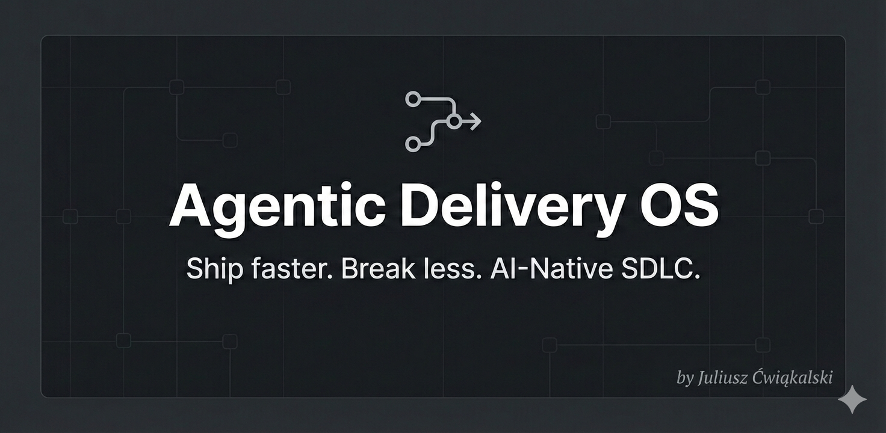

<p align="center">
  <a href="./assets/hero.png">
    <picture>
      <source srcset="assets/hero.webp" type="image/webp" />
      
    </picture>
  </a>
</p>

# Agentic Delivery OS

Turn AI from "chat assistance" into a repeatable, auditable delivery system:

ticket -> spec -> plan -> test plan -> code -> [/review](.opencode/command/review.md) -> [/sync-docs](.opencode/command/sync-docs.md) -> [/check](.opencode/command/check.md) -> [/pr](.opencode/command/pr.md) -> release

This repo is a practical reference implementation of a spec-driven workflow using OpenCode:

- Artifacts are first-class (versioned in Git), not trapped in chats.
- Deterministic quality gates define "done".
- The workflow is tracker-agnostic: the tracker owns status, Git stores the delivery artifacts.
- The repo maintains a continuously updated "current system spec" under `doc/spec/**` (created if missing; reconciled after each accepted change).

> Note: `doc/spec/**` may not exist in a fresh repo; it's created/updated by the workflow (see [/sync-docs](.opencode/command/sync-docs.md)).

## Why this exists

AI can generate code quickly, but most teams struggle to use it reliably at scale:

- Prompts live in DMs and chat logs (not versioned, not repeatable)
- Output quality varies day-to-day ("prompt roulette")
- Delivery still needs specs, acceptance criteria, test strategy, reviews, docs, release discipline
- Tooling glue work persists between Jira/Git/CI/docs

Agentic Delivery OS codifies a predictable pipeline where quality and traceability are non-negotiable.

## What this gives you

- A small "virtual team" of repo-local OpenCode agents aligned to SDLC roles (PM, spec writer, planner, executor, reviewer).
- A standard artifact set (spec, implementation plan, test plan) stored under `doc/changes/` using stable, tracker-linked names.
- A versioned, human-readable system spec under `doc/spec/**` that acts as the baseline input for planning the next change (kept up to date via [`/sync-docs`](.opencode/command/sync-docs.md)).
- Commands that compose those agents into repeatable workflows (manual or autopilot).

## Benefits

- Less ambiguity: specs and test plans are explicit before code is written.
- Predictable planning: next changes can start from the current system spec (`doc/spec/**`) instead of rebuilding context from chat history.
- Higher trust: [/review](.opencode/command/review.md) and [/check](.opencode/command/check.md) run against artifacts, not vibes.
- Quality is non-negotiable: [/review](.opencode/command/review.md) iterates until PASS and [/check](.opencode/command/check.md) is green before you get a PR/MR (via [/pr](.opencode/command/pr.md)) to look at.
- Faster iteration: agents can find the right context deterministically (stable paths, no global indexes).
- Better auditability: tickets link to change folders, branches, PR descriptions, and logs.
- Less noise: in autopilot mode, the tracker is the interface; the [@pm](.opencode/agent/pm.md) agent pings you only when decisions/clarifications/reviews are needed.

## Intention (why I use this)

I use this repo to evolve and validate an AI-native delivery operating model on real work: reduce "prompt roulette", keep humans accountable, and make shipping faster without lowering quality.

## Docs at a glance

- How to use the agents/commands: [doc/guides/opencode-agents-and-commands-guide.md](doc/guides/opencode-agents-and-commands-guide.md)
- Change delivery lifecycle (10-phase workflow): [doc/guides/change-lifecycle.md](doc/guides/change-lifecycle.md)
- Change folder + naming convention (workItemRef, branches, files): [doc/guides/unified-change-convention-tracker-agnostic-specification.md](doc/guides/unified-change-convention-tracker-agnostic-specification.md)
- Broader docs layout standard (some details may differ per repo): [doc/documentation-handbook.md](doc/documentation-handbook.md)
- Tooling definitions (agents/commands): [.opencode/README.md](.opencode/README.md)
- Tracker/PM setup for autopilot mode: [.ai/agent/pm-instructions.md](.ai/agent/pm-instructions.md)

## What is implemented here

OpenCode tooling (see [.opencode/README.md](.opencode/README.md) for the authoritative list):

- Agents for common SDLC roles:
  - [@pm](.opencode/agent/pm.md), [@delivery-agent](.opencode/agent/delivery-agent.md), [@spec-writer](.opencode/agent/spec-writer.md), [@plan-writer](.opencode/agent/plan-writer.md), [@test-plan-writer](.opencode/agent/test-plan-writer.md), [@executor](.opencode/agent/executor.md), [@reviewer](.opencode/agent/reviewer.md), [@doc-syncer](.opencode/agent/doc-syncer.md), [@pr-manager](.opencode/agent/pr-manager.md), [@runner](.opencode/agent/runner.md), [@fixer](.opencode/agent/fixer.md), [@committer](.opencode/agent/committer.md), [@architect](.opencode/agent/architect.md), [@editor](.opencode/agent/editor.md), [@designer](.opencode/agent/designer.md), [@image-reviewer](.opencode/agent/image-reviewer.md).
- Commands that compose them into a repeatable workflow:
  - [/plan-change](.opencode/command/plan-change.md), [/write-spec](.opencode/command/write-spec.md), [/write-plan](.opencode/command/write-plan.md), [/write-test-plan](.opencode/command/write-test-plan.md), [/run-plan](.opencode/command/run-plan.md), [/review](.opencode/command/review.md), [/review-deep](.opencode/command/review-deep.md), [/sync-docs](.opencode/command/sync-docs.md), [/check](.opencode/command/check.md), [/check-fix](.opencode/command/check-fix.md), [/pr](.opencode/command/pr.md), [/commit](.opencode/command/commit.md), [/plan-decision](.opencode/command/plan-decision.md), [/write-adr](.opencode/command/write-adr.md).

## Autopilot (PM-driven)

Autopilot mode is a high-level handoff: you provide a ticket reference (or URL) and the [@pm](.opencode/agent/pm.md) agent orchestrates the full delivery loop (including [/review](.opencode/command/review.md), [/sync-docs](.opencode/command/sync-docs.md), and [/check](.opencode/command/check.md)), then creates/updates a PR/MR via [/pr](.opencode/command/pr.md) only when it's ready for human review.

Example prompt:

```text
@pm deliver change https://menuvivo.atlassian.net/browse/PDEV-29
```

(You can also use a GitHub issue URL or a `workItemRef` like `GH-456`.)

## Typical workflow (manual)

For the detailed walkthrough, see [doc/guides/opencode-agents-and-commands-guide.md](doc/guides/opencode-agents-and-commands-guide.md). The common flow is:

```text
/plan-change <workItemRef?>
/write-spec <workItemRef>
/write-plan <workItemRef>
/write-test-plan <workItemRef>
/run-plan <workItemRef>
/review <workItemRef>
/sync-docs <workItemRef>
/check
/pr
```

Tool definitions: [/plan-change](.opencode/command/plan-change.md), [/write-spec](.opencode/command/write-spec.md), [/write-plan](.opencode/command/write-plan.md), [/write-test-plan](.opencode/command/write-test-plan.md), [/run-plan](.opencode/command/run-plan.md), [/review](.opencode/command/review.md), [/sync-docs](.opencode/command/sync-docs.md), [/check](.opencode/command/check.md), [/pr](.opencode/command/pr.md)

## Change artifacts (tracker-agnostic)

Changes are identified by `workItemRef` (for example `PDEV-123` for Jira or `GH-456` for GitHub). Artifacts live under:

- `doc/changes/YYYY-MM/YYYY-MM-DD--<workItemRef>--<slug>/`
- Stable filenames inside the folder:
  - `chg-<workItemRef>-spec.md`
  - `chg-<workItemRef>-plan.md`
  - `chg-<workItemRef>-test-plan.md`
  - `chg-<workItemRef>-pm-notes.yaml` (progress tracking, decisions, open questions)

After the change is implemented and accepted, the workflow reconciles the "current truth" docs (via [/sync-docs](.opencode/command/sync-docs.md)):

- `doc/spec/**` (system specification)
- `doc/contracts/**` (interfaces/contracts, when used)

Branches follow conventional-commit-aligned types:

- `<type>/<workItemRef>/<slug>` (for example `feat/PDEV-123/responsive-recipes-images`)

## Repo structure

```
.
├── .opencode/        # OpenCode agents and commands (repo-local tooling)
└── doc/
    ├── guides/       # how-to guides (OpenCode workflow, naming conventions)
    ├── spec/         # current system spec (reconciled after each accepted change)
    └── documentation-handbook.md
```

## License

Open-source. See [LICENSE](LICENSE).

## Author

Maintained by Juliusz Ćwiąkalski. If you find this useful, follow me or drop by my homepage (blog + newsletter):

- LinkedIn: [@juliusz-cwiakalski](https://www.linkedin.com/in/juliusz-cwiakalski/)
- X: [@cwiakalski](https://x.com/cwiakalski)
- Website (blog + newsletter): https://www.cwiakalski.com
