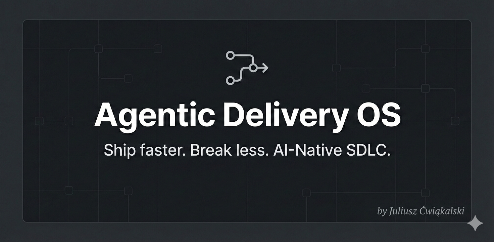
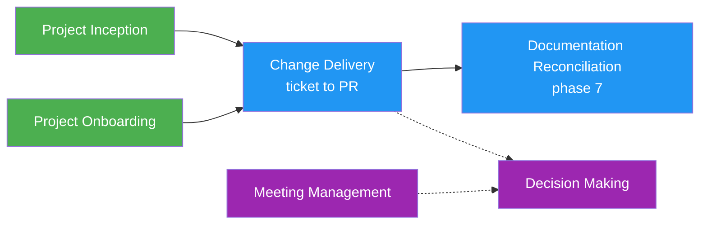

---
# Copyright (c) 2025-2026 Juliusz Ćwiąkalski (https://www.cwiakalski.com | https://www.linkedin.com/in/juliusz-cwiakalski/ | https://x.com/cwiakalski)
# MIT License - see LICENSE file for full terms
source: https://github.com/juliusz-cwiakalski/agentic-delivery-os/blob/main/README.md
---
<p align="center">
  <a href="./assets/hero.png">
    <picture>
      <source srcset="assets/hero.webp" type="image/webp" />
      
    </picture>
  </a>
</p>

# Agentic Delivery OS (ADOS)

Turn AI from "chat assistance" into a repeatable, auditable delivery system. ADOS has **six processes** — open the [canonical process map](doc/guides/ados-processes.md) for the big picture:


```mermaid
flowchart LR
    INC["Project Inception"] --> DEL["Change Delivery<br/>ticket to PR"]
    ONB["Project Onboarding"] --> DEL
    DEL --> DOCS["Documentation Reconciliation<br/>phase 7"]
    DEL -.-> DEC["Decision Making"]
    MTG["Meeting Management"] -.-> DEC
    style INC fill:#4CAF50,color:#fff
    style ONB fill:#4CAF50,color:#fff
    style DEL fill:#2196F3,color:#fff
    style DOCS fill:#2196F3,color:#fff
    style DEC fill:#9C27B0,color:#fff
    style MTG fill:#9C27B0,color:#fff
```

**Legend**: green = entry points · blue = steady-state / embedded · purple = cross-cutting supporters · dashed = on-demand. (GitHub renders Mermaid without clickable nodes — click a process name below to open its guide.)

- **[Project Inception](doc/guides/project-inception.md)** — build the full knowledge base (vision, architecture, domain) for a **new** project so agents can operate autonomously.
- **[Project Onboarding](doc/guides/onboarding-existing-project.md)** — adopt ADOS into an **existing** repo with the minimum viable setup.
- **[Change Delivery](doc/guides/change-lifecycle.md)** — the day-to-day 11-phase loop turning a ticket into a reviewed, tested PR.
- **[Decision Making](doc/guides/decision-making.md)** — calibrate decision rigor to risk (R0–R3); capture durable records.
- **[Meeting Management](doc/guides/meeting-preparation-and-summarization.md)** — prepare, run, and document meetings with durable decisions and action items.

> Documentation Reconciliation (phase 7 of Change Delivery) keeps `doc/spec/**` the living current truth after every change — no separate guide.

This repo is a practical reference implementation of a spec-driven workflow using OpenCode (and supporting Claude Code):

- Artifacts are first-class (versioned in Git), not trapped in chats.
- Deterministic quality gates define "done".
- The workflow is tracker-agnostic: the tracker owns status, Git stores the delivery artifacts.
- The repo maintains a continuously updated "current system spec" under `doc/spec/**` (created if missing; reconciled after each accepted change).

> Note: `doc/spec/**` may not exist in a fresh repo; it's created/updated by the workflow (see [/sync-docs](.opencode/command/sync-docs.md)).

<!-- TOC -->
* [Agentic Delivery OS (ADOS)](#agentic-delivery-os-ados)
  * [Why this exists](#why-this-exists)
  * [What this gives you](#what-this-gives-you)
  * [Installation](#installation)
    * [Quick Start](#quick-start)
      * [For Claude Code users](#for-claude-code-users)
    * [Installation Modes](#installation-modes)
    * [Tool Selection (OpenCode only)](#tool-selection-opencode-only)
  * [Docs at a glance](#docs-at-a-glance)
  * [What is implemented here](#what-is-implemented-here)
  * [Multi-tool support](#multi-tool-support)
  * [Autopilot (PM-driven)](#autopilot-pm-driven)
  * [Typical workflow (manual)](#typical-workflow-manual)
  * [Change artifacts (tracker-agnostic)](#change-artifacts-tracker-agnostic)
  * [Repo structure](#repo-structure)
  * [License](#license)
  * [Author](#author)
<!-- TOC -->

## Why this exists

AI can generate code quickly, but most teams struggle to use it reliably at scale:

- Prompts live in DMs and chat logs (not versioned, not repeatable)
- Output quality varies day-to-day ("prompt roulette")
- Delivery still needs specs, acceptance criteria, test strategy, reviews, docs, release discipline
- Tooling glue work persists between Jira/Git/CI/docs

Agentic Delivery OS codifies a predictable pipeline where quality and traceability are non-negotiable — an AI-native delivery operating model that keeps humans accountable and ships faster without lowering quality.

## What this gives you

- A team of role-specialized agents aligned to SDLC roles (PM, spec writer, planner, coder, reviewer, bootstrapper, …).
- A standard artifact set (spec, plan, test plan) stored under `doc/changes/` using stable, tracker-linked names.
- A versioned, human-readable system spec under `doc/spec/**` — the baseline for planning the next change, kept current via [`/sync-docs`](.opencode/command/sync-docs.md).
- Commands that compose those agents into repeatable workflows (manual or autopilot).
- Gated quality: [/review](.opencode/command/review.md) iterates to PASS and [/check](.opencode/command/check.md) is green before a [/pr](.opencode/command/pr.md) reaches you.
- Less noise: in autopilot, the tracker is the interface — [@pm](.opencode/agent/pm.md) pings you only for decisions, clarifications, and reviews.

## Installation

### Quick Start

**For OpenCode users:**

```bash
# Global (all projects)
curl -fsSL https://raw.githubusercontent.com/juliusz-cwiakalski/agentic-delivery-os/main/scripts/install.sh | bash -s -- --global

# Local (current project)
~/.ados/repo/scripts/install.sh --local
```

Then in your AI coding agent:

```text
/bootstrap                                  # AI-guided configuration
```

#### For Claude Code users

**Recommended: Install from GitHub marketplace**

```bash
# Step 1: Add ADOS marketplace (one-time setup)
/plugin marketplace add juliusz-cwiakalski/agentic-delivery-os

# Step 2: Install ADOS plugin
/plugin install ados@ados
```

This uses the `git-subdir` source to load ADOS directly from the GitHub repository.

**For local development (contributors):**

```bash
claude --plugin-dir .ados-claude
```

This loads ADOS directly from the local repo — useful for contributors testing changes.

### Installation Modes

| Mode | OpenCode Target | Claude Code Target |
|------|-----------------|-------------------|
| `--global` | `~/.config/opencode/` | Use `/plugin marketplace add` |
| `--local` | `./.opencode/` | `claude --plugin-dir .ados-claude` |

### Tool Selection (OpenCode only)

```bash
--tool opencode    # OpenCode only (default)
--tool claude      # Not needed - use /plugin commands instead
--tool all         # Not needed - install separately per tool
```

**Uninstall:** `~/.ados/repo/scripts/uninstall.sh --global` or `~/.ados/repo/scripts/uninstall.sh --local`

> **Update:** Re-run the same install commands to update to the latest version.

> Full guide: [doc/guides/onboarding-existing-project.md](doc/guides/onboarding-existing-project.md)

## Docs at a glance

- AI agent & contributor quick-reference: [AGENTS.md](AGENTS.md)
- How to use the agents/commands: [doc/guides/opencode-agents-and-commands-guide.md](doc/guides/opencode-agents-and-commands-guide.md)
- Change delivery lifecycle (11-phase workflow): [doc/guides/change-lifecycle.md](doc/guides/change-lifecycle.md)
- Change folder + naming convention (workItemRef, branches, files): [doc/guides/unified-change-convention-tracker-agnostic-specification.md](doc/guides/unified-change-convention-tracker-agnostic-specification.md)
- Broader docs layout standard (some details may differ per repo): [doc/documentation-handbook.md](doc/documentation-handbook.md)
- Tooling definitions (agents/commands): [.opencode/README.md](.opencode/README.md)
- Tracker/PM setup for autopilot mode: [.ai/agent/pm-instructions.md](.ai/agent/pm-instructions.md)
- Onboarding guide (adopt ADOS in your project): [doc/guides/onboarding-existing-project.md](doc/guides/onboarding-existing-project.md)

## What is implemented here

A team of **role-specialized agents** (PM, spec-writer, plan-writer, test-plan-writer, coder, reviewer, readiness gate, doc-syncer, pr-manager, decision-advisor, bootstrapper, …) and the **commands** that compose them into the delivery workflow — autopilot or manual. See the authoritative inventory in [.opencode/README.md](.opencode/README.md) and the quick-reference in [AGENTS.md](AGENTS.md).

## Multi-tool support

ADOS supports multiple AI coding tools while maintaining a **single source of truth** for agent and command definitions:

- **`.opencode/`** — Canonical source for all agent/command definitions
- **`.ados-claude/`** — Generated Claude Code plugin (committed to repo, ready to use)

The build script `scripts/build-claude-plugin.sh` transforms `.opencode/` definitions to Claude Code format. This ensures:

1. No duplicate definitions to maintain
2. All tools get the same prompts
3. Model assignments are tool-specific (via `claude.model` frontmatter)

**For Claude Code users:**

The `.ados-claude/` directory is pre-generated and committed to the repo. No build step required.

Install options:

- **Marketplace (recommended):**
  ```
  /plugin marketplace add juliusz-cwiakalski/agentic-delivery-os
  /plugin install ados@ados
  ```
- **Local development:** `claude --plugin-dir .ados-claude`

Point Claude Code at the plugin root (`.ados-claude/`), not at the `agents/` or `skills/` subdirectories — Claude Code reads `.claude-plugin/plugin.json` from the directory you pass.

**Marketplace structure:**
- `.claude-plugin/marketplace.json` (repo root) - Tells Claude Code where to find the ADOS plugin
- `.ados-claude/.claude-plugin/plugin.json` - The actual plugin manifest (inside the plugin directory)

**For OpenCode users:**

No changes — continue using `.opencode/` as before. The `claude:` frontmatter key is ignored by OpenCode.

**Adding new tools:**

See [doc/guides/adding-tool-support.md](doc/guides/adding-tool-support.md) for the extensibility pattern.

## Autopilot (PM-driven)

Autopilot mode is a high-level handoff: you provide a ticket reference (or URL) and the [@pm](.opencode/agent/pm.md) agent orchestrates the full delivery loop (including [/review](.opencode/command/review.md), [/sync-docs](.opencode/command/sync-docs.md), and [/check](.opencode/command/check.md)), then creates/updates a PR/MR via [/pr](.opencode/command/pr.md) only when it's ready for human review.

Example prompt:

```text
@pm deliver change GH-456
```

(You can also use a GitHub issue URL or a `workItemRef` like `GH-456`.)

## Typical workflow (manual)

For the detailed walkthrough, see [doc/guides/opencode-agents-and-commands-guide.md](doc/guides/opencode-agents-and-commands-guide.md). The common flow is:

```text
/plan-change <workItemRef?>
/write-spec <workItemRef>
/write-test-plan <workItemRef>
/write-plan <workItemRef>
/run-plan <workItemRef>
/sync-docs <workItemRef>
/review <workItemRef>
/check
/pr
```

Tool definitions: [/plan-change](.opencode/command/plan-change.md), [/write-spec](.opencode/command/write-spec.md), [/write-plan](.opencode/command/write-plan.md), [/write-test-plan](.opencode/command/write-test-plan.md), [/run-plan](.opencode/command/run-plan.md), [/review](.opencode/command/review.md), [/sync-docs](.opencode/command/sync-docs.md), [/check](.opencode/command/check.md), [/pr](.opencode/command/pr.md)

## Change artifacts (tracker-agnostic)

Changes are identified by `workItemRef` (for example `PDEV-123` for Jira or `GH-456` for GitHub). Artifacts live under:

- `doc/changes/YYYY-MM/YYYY-MM-DD--<workItemRef>--<slug>/`
- Stable filenames inside the folder:
  - `chg-<workItemRef>-spec.md`
  - `chg-<workItemRef>-plan.md`
  - `chg-<workItemRef>-test-plan.md`
  - `chg-<workItemRef>-pm-notes.yaml` (progress tracking, decisions, open questions)

After the change is implemented and accepted, the workflow reconciles the "current truth" docs (via [/sync-docs](.opencode/command/sync-docs.md)):

- `doc/spec/**` (system specification)
- `doc/contracts/**` (interfaces/contracts, when used)

Branches follow conventional-commit-aligned types:

- `<type>/<workItemRef>/<slug>` (for example `feat/PDEV-123/responsive-product-images`)

## Repo structure

```
.
├── AGENTS.md             # delivery system bootstrap (start here)
├── .opencode/            # agent and command definitions (THE product)
│   ├── agent/            # agents (one .md each)
│   └── command/          # commands (one .md each)
├── .ai/
│   ├── agent/            # PM tracker config (pm-instructions.md)
│   ├── local/            # git-ignored ephemeral state
│   └── rules/            # language/tool rules (bash.md)
├── scripts/              # repo-internal automation (.sh extension)
│   └── .tests/           # test files for scripts (test-*.sh)
├── tools/                # PATH-able CLI utilities (no .sh extension)
│   └── .tests/           # test files for tools (test-*.sh)
└── doc/
    ├── 00-index.md           # documentation landing page
    ├── changes/              # change artifacts (spec, plan, test-plan per workItemRef)
    ├── decisions/            # decision records (ADR/PDR/TDR/BDR/ODR)
    ├── guides/               # how-to guides
    ├── overview/             # north star, architecture, glossary
    ├── planning/             # internal planning notes
    ├── spec/                 # current system spec (reconciled after each change)
    ├── templates/            # core + optional profile-aware document templates
    ├── tools/                # CLI tool user guides
    └── documentation-handbook.md
```

## License

Open-source. See [LICENSE](LICENSE).

## Author

Maintained by Juliusz Ćwiąkalski. If you find this useful, follow me or drop by my homepage (blog + newsletter):

- LinkedIn: [@juliusz-cwiakalski](https://www.linkedin.com/in/juliusz-cwiakalski/)
- X: [@cwiakalski](https://x.com/cwiakalski)
- Website (blog + newsletter): https://www.cwiakalski.com
