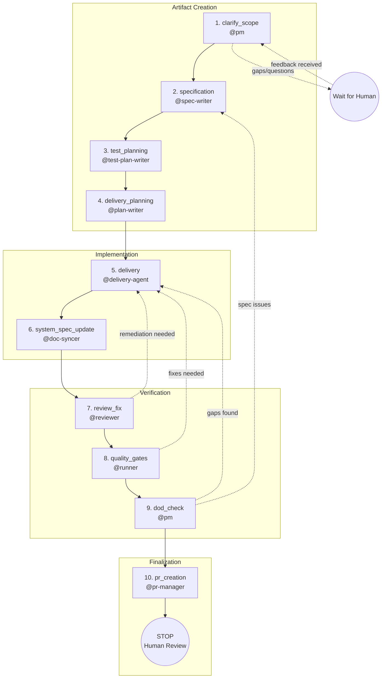

---
# Copyright (c) 2025-2026 Juliusz Cwiakalski (https://www.cwiakalski.com | https://www.linkedin.com/in/juliusz-cwiakalski/ | https://x.com/cwiakalski)
# MIT License - see LICENSE file for full terms
# Latest version: https://github.com/juliusz-cwiakalski/agentic-delivery-os/blob/main/doc/guides/change-lifecycle.md
id: GUIDE-CHANGE-LIFECYCLE
status: Draft
created: 2026-02-03
owners: ["engineering"]
summary: "End-to-end change delivery workflow (planning to PR) with PM-led gates and artifacts." 
---

# Change Lifecycle

This guide defines the canonical change workflow for this repository. The PM agent (`@pm`) orchestrates the entire lifecycle, delegating to specialized agents at each phase.

## Principles

- One ticket = one change.
- The ticket tracker is the source of truth for status.
- Change artifacts live under `doc/changes/` following the Unified Change Convention.
- Local, ephemeral agent state lives under `.ai/local/` and is git-ignored.
- `@pm` focuses on one ticket per conversation unless the user explicitly requests a planning-only session.
- Phases can be reopened: if PM discovers incomplete work in a later phase, PM reopens the relevant phase and delegates to the appropriate agent.

## Required Artifacts (per change)

Inside the change folder `doc/changes/YYYY-MM/YYYY-MM-DD--<workItemRef>--<slug>/`:

| Artifact | Purpose | Mandatory |
|----------|---------|-----------|
| `chg-<workItemRef>-spec.md` | Canonical specification (problem, goals, AC, DoD) | Yes |
| `chg-<workItemRef>-test-plan.md` | Test strategy and traceability to AC | Yes |
| `chg-<workItemRef>-plan.md` | Phased implementation plan with checklists | Yes |
| `chg-<workItemRef>-pm-notes.yaml` | PM progress tracking, decisions, open questions (git-committed for traceability) | **Yes** |
| `chg-<workItemRef>-notes.md` | Free-form notes, experiments, links | No |

## Change Phases (PM-controlled)

Phases are ordered and gated. A phase is not complete unless its artifacts exist and are consistent.

**Key**: Phases can be reopened. If PM discovers incomplete work in a later phase (e.g., `dod_check` finds missing delivery tasks), PM reopens the relevant phase (`delivery`) and delegates to the appropriate agent.



**Legend**:
- Solid arrows: normal forward flow
- Dashed arrows: feedback loops (phase reopening when gaps are discovered)

### 1) clarify_scope

**Owner**: `@pm`

**Goal**: Fully understand the intention of the change and ensure all information is complete before proceeding. This phase aims to minimize late-discovered gaps that would require returning to earlier phases.

**Actions**:

- Read the ticket from the tracker (via MCP).
- **Review current system specification** (`doc/spec/**`) to understand existing behavior, contracts, and constraints relevant to this change.
- Cross-check ticket requirements against system specification:
  - Identify contradictions between requested changes and existing system behavior.
  - Identify dependencies on existing features or contracts.
  - Identify edge cases that may not be addressed in the ticket.
- Analyze requirements for completeness: acceptance criteria, constraints, dependencies, edge cases.
- Identify any gaps, contradictions, or missing key information.
- If issues are found:
  1. Add a comment to the ticket with specific questions (referencing system spec where relevant).
  2. Assign the ticket back to the human owner.
  3. **STOP and wait** for human feedback.
  4. Resume only after feedback is provided.
- Record all open questions, assumptions, and clarifications in `chg-<workItemRef>-pm-notes.yaml`.

**Outcome**: Requirements are complete, unambiguous, and consistent with the current system specification — ready to write the spec, OR ticket is assigned back to human with questions.

**Exit criteria**:

- No blocking open questions remain (all answered by human).
- Requirements are consistent with current system specification.
- PM notes updated with assumptions, clarifications, and relevant system spec references.
- Ticket is assigned to PM (not waiting on human).

### 2) specification

**Owner**: `@pm` delegates to `@spec-writer`

**Goal**: Produce the canonical specification that drives planning and delivery.

**Actions**:

- `@pm` delegates to `@spec-writer` with `workItemRef` and planning summary.
- `@spec-writer` creates or updates `chg-<workItemRef>-spec.md`.

**Outcome**: A complete spec with problem statement, goals, scope, acceptance criteria, and definition of done.

**Exit criteria**:

- `chg-<workItemRef>-spec.md` exists and is committed.
- Spec is complete enough for test planning and implementation planning.

### 3) test_planning

**Owner**: `@pm` delegates to `@test-plan-writer`

**Goal**: Define verification strategy and traceability to acceptance criteria.

**Actions**:

- `@pm` delegates to `@test-plan-writer` with `workItemRef`.
- `@test-plan-writer` creates or updates `chg-<workItemRef>-test-plan.md`.

**Outcome**: A test plan with test strategy, test cases, and traceability matrix linking tests to AC.

**Exit criteria**:

- `chg-<workItemRef>-test-plan.md` exists and is committed.
- Every acceptance criterion is covered or explicitly marked TODO with an open question.

### 4) delivery_planning

**Owner**: `@pm` delegates to `@plan-writer`

**Goal**: Produce an actionable phased plan for implementation.

**Actions**:

- `@pm` delegates to `@plan-writer` with `workItemRef`.
- `@plan-writer` creates or updates `chg-<workItemRef>-plan.md`.

**Outcome**: A phased implementation plan with check-listable tasks aligned with the spec and test plan.

**Exit criteria**:

- `chg-<workItemRef>-plan.md` exists and is committed.
- Plan is phased, check-listable, and aligns with the spec and test plan.

### 5) delivery

**Owner**: `@pm` hands over to `@delivery-agent`

**Goal**: Implement the change in code according to the plan.

**Actions**:

- `@pm` invokes `@delivery-agent` with `workItemRef`.
- `@delivery-agent` executes the plan in phases, delegating to:
  - `@executor` for implementation tasks
  - `@designer` for UI/UX work
  - `@runner` for running commands and capturing logs
  - `@fixer` for debugging and fixing failures
  - `@architect` for technical/architectural decisions
  - `@committer` for checkpointing progress

**Outcome**: All implementation phases in the plan are complete with code changes committed.

**Exit criteria**:

- Plan tasks for implementation phases are complete with evidence (commits, tests, logs).
- All implementation-related checkboxes in the plan are checked.

### 6) system_spec_update

**Owner**: `@pm` delegates to `@doc-syncer`

**Goal**: Ensure repo-level system specs/docs reflect the new truth.

**Actions**:

- `@pm` invokes `@doc-syncer` with `workItemRef`.
- `@doc-syncer` reconciles `doc/spec/**`, `doc/contracts/**`, and other system documentation.

**Outcome**: System specification is updated and consistent with the implementation.

**Exit criteria**:

- System docs updated and committed.
- No discrepancies between implementation and documented system state.

### 7) review_fix

**Owner**: `@pm` delegates to `@reviewer`, then `@delivery-agent`/`@executor` for fixes

**Goal**: Ensure the implementation matches the spec and plan.

**Actions**:

- `@pm` invokes `@reviewer` with `workItemRef`.
- `@reviewer` audits code vs. spec/plan, checks test coverage, identifies gaps.
- If reviewer returns `Status=FAIL` or adds remediation tasks:
  - Remediation phase is appended to `chg-<workItemRef>-plan.md`.
  - `@pm` invokes `@delivery-agent` or `@executor` to address remediation.
  - Re-run `@reviewer` until `Status=PASS`.

**Outcome**: All review findings addressed; implementation verified against spec.

**Exit criteria**:

- `@reviewer` returns `Status=PASS`.
- No open remediation tasks in the plan.

### 8) quality_gates

**Owner**: `@pm` delegates to `@runner`, then `@fixer` if needed

**Goal**: Ensure builds/tests and repo conventions pass.

**Actions**:

- `@pm` invokes `@runner` to run quality gates per repo conventions (build, test, lint, etc.).
- If failures occur:
  - `@pm` invokes `@fixer` to diagnose and fix.
  - Re-run quality gates until all pass.

**Outcome**: All required checks pass; logs/evidence captured.

**Exit criteria**:

- Build passes.
- Tests pass.
- Lint/format checks pass.
- Any other repo-specific quality gates pass.

### 9) dod_check

**Owner**: `@pm`

**Goal**: Confirm the change is actually done — final acceptance gate.

**Actions**:

- `@pm` performs a checklist review:
  - All phases above completed (check `chg-<workItemRef>-pm-notes.yaml`).
  - All delivery plan tasks complete (all checkboxes checked in `chg-<workItemRef>-plan.md`).
  - All acceptance criteria satisfied (verify against `chg-<workItemRef>-spec.md`).
  - No pending TODOs without an explicit follow-up ticket.
- **If any gap is found**: reopen the appropriate phase and delegate to the relevant agent.
  - Example: if a delivery plan task is incomplete, reopen `delivery` and delegate to `@delivery-agent`.

**Outcome**: Full verification that the change meets the Definition of Done.

**Exit criteria**:

- DoD satisfied.
- `chg-<workItemRef>-pm-notes.yaml` updated with all phases completed.

### 10) pr_creation

**Owner**: `@pm` delegates to `@pr-manager`

**Goal**: Create the PR/MR and hand off to a human reviewer.

**Actions**:

- `@pm` invokes `@pr-manager` to create or update the PR/MR.
- `@pm` assigns the ticket to a human reviewer in the tracker.
- **STOP**: Do not start another ticket automatically.

**Outcome**: PR/MR is ready for human review; ticket is assigned.

**Exit criteria**:

- PR/MR exists and is up to date.
- Ticket is assigned to a human reviewer.
- `@pm` stops and waits for human approval and merge.

---

## Phase Reopening

Phases are not strictly linear. If PM discovers incomplete work in a later phase, PM can reopen an earlier phase:

| Discovery in... | Gap found | Action |
|-----------------|-----------|--------|
| `dod_check` | Delivery plan task incomplete | Reopen `delivery`, delegate to `@delivery-agent` |
| `dod_check` | AC not satisfied | Reopen `delivery` or `specification` as needed |
| `quality_gates` | Test failure reveals missing implementation | Reopen `delivery`, delegate to `@fixer` or `@executor` |
| `review_fix` | Spec ambiguity discovered | Reopen `clarify_scope` or `specification` |

After addressing the gap, PM continues from the reopened phase through the remaining phases.

---

## PM Notes Structure (`chg-<workItemRef>-pm-notes.yaml`)

The PM notes file is **mandatory** for every change. It serves as:
- PM's long-term memory for the change
- Status tracking across sessions
- Traceability via git history

```yaml
change_id: GH-5
title: "Improve PM agent configuration and context storage"
phases:
  clarify_scope: { started: "2026-02-02T10:00:00Z", completed: "2026-02-02T10:30:00Z" }
  specification: { started: "2026-02-02T10:30:00Z", completed: "2026-02-02T11:00:00Z" }
  test_planning: { started: null, completed: null }
  delivery_planning: { started: null, completed: null }
  delivery: { started: null, completed: null }
  system_spec_update: { started: null, completed: null }
  review_fix: { started: null, completed: null }
  quality_gates: { started: null, completed: null }
  dod_check: { started: null, completed: null }
  pr_creation: { started: null, completed: null }
decisions: []
open_questions: []
blockers: []
notes: ""
```

---

## Agent Responsibilities Summary

| Phase | Primary Agent | Supporting Agents |
|-------|---------------|-------------------|
| 1. clarify_scope | `@pm` | — |
| 2. specification | `@spec-writer` | — |
| 3. test_planning | `@test-plan-writer` | — |
| 4. delivery_planning | `@plan-writer` | — |
| 5. delivery | `@delivery-agent` | `@executor`, `@designer`, `@runner`, `@fixer`, `@architect`, `@committer` |
| 6. system_spec_update | `@doc-syncer` | — |
| 7. review_fix | `@reviewer` | `@delivery-agent`, `@executor` |
| 8. quality_gates | `@runner` | `@fixer` |
| 9. dod_check | `@pm` | — |
| 10. pr_creation | `@pr-manager` | — |

---

## Issue Tracker Communication Policy

Use comments as a knowledge base. Comment only when it adds durable value:

- Decisions taken (and rationale)
- Scope changes
- Open questions + answers
- Blockers and investigative findings

Avoid generic status updates. Use tracker state/labels for status.
