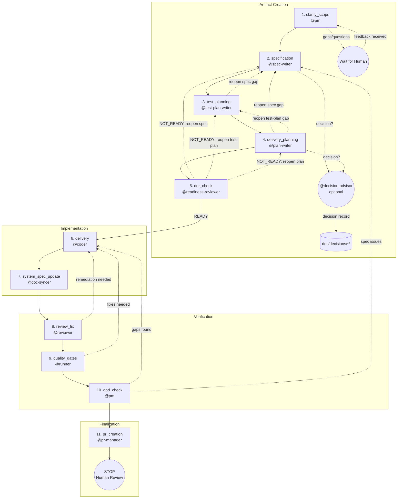

---
# Copyright (c) 2025-2026 Juliusz Ćwiąkalski (https://www.cwiakalski.com | https://www.linkedin.com/in/juliusz-cwiakalski/ | https://x.com/cwiakalski)
# MIT License - see LICENSE file for full terms
source: https://github.com/juliusz-cwiakalski/agentic-delivery-os/blob/main/doc/guides/change-lifecycle.md
ados_distribution: redistributable
id: GUIDE-CHANGE-LIFECYCLE
status: Draft
created: 2026-02-03
owners: ["engineering"]
summary: "End-to-end change delivery workflow (planning to PR) with PM-led gates and artifacts." 
---

# Change Lifecycle

This guide defines the canonical change workflow for this repository. The PM agent (`@pm`) orchestrates the entire lifecycle, delegating to specialized agents at each phase.

> Part of the [ADOS process map](ados-processes.md) — Change Delivery is the steady-state loop; [Decision Making](decision-making.md) is consulted on demand during artifact creation, and [Documentation Reconciliation](#7-system_spec_update) runs as phase 7.

## Principles

- One ticket = one change.
- The ticket tracker is the source of truth for status.
- Change artifacts live under `doc/changes/` following the Unified Change Convention.
- Local, ephemeral agent state lives under `.ai/local/` and is git-ignored.
- `@pm` focuses on one ticket per conversation unless the user explicitly requests a planning-only session.
- Phases can be reopened: if PM discovers incomplete work in a later phase, PM reopens the relevant phase and delegates to the appropriate agent.
- Artifact-creation phases (`specification` → `test_planning` → `delivery_planning`) are **strictly sequential**: each phase must complete before the next begins, and each consumes the previous artifact(s). This prevents cross-artifact drift (TC IDs, file names, AC coverage, canonical values diverging). The PM delegates them one at a time, waiting for completion.

## Branch and Commit Responsibility Model

This repository enforces a single source of truth for git operations: the orchestrator of a phase owns the commit trigger for that phase's output, and all commits route through `@committer` (or the `/commit` command, which invokes `@committer`).

### Branch Ownership

**Autonomous mode** (PM-driven delivery):
- The PM ensures the change branch exists and is checked out before its first delegation (step 4a of phase 1).
- Branch name format: `<type>/<workItemRef>/<slug>` (e.g., `feat/GH-123/some-feature`)
- The PM records the branch in `chg-<workItemRef>-pm-notes.yaml` and `.ai/local/pm-context.yaml`.
- Delegated agents never touch branch state (no checkout, create, or switch operations).

**Manual mode** (command-driven):
- The manual artifact commands (`/write-spec`, `/write-test-plan`, `/write-plan`, `/sync-docs`, `/write-decision`) keep their existing branch-ensure step as a safety net.
- Branch setup happens before agent delegation, consistent with autonomous mode.

### Commit Trigger Ownership

**Autonomous mode** (PM-driven delivery):
- The PM triggers `@committer` after each delegated lifecycle phase returns, with a phase-appropriate intent hint (e.g., "add spec for GH-123", "add test plan for GH-123").
- Phases with commit triggers: `specification` (after @spec-writer), `test_planning` (after @test-plan-writer), `delivery_planning` (after @plan-writer), `dor_check` (after @readiness-reviewer verdict), `system_spec_update` (after @doc-syncer), and `review_fix` (after @reviewer).
- The PM commits the `@readiness-reviewer` verdict file for traceability of each DoR iteration.
- The `no commit` directive (bare string in `chg-<workItemRef>-pm-notes.yaml` directives array or in the original request) suppresses the trigger for a phase.

**Manual mode** (command-driven):
- Each manual command triggers `/commit` (which invokes `@committer`) after the delegated agent returns, with an appropriate intent hint.
- Phases with commit triggers: `/write-spec`, `/write-test-plan`, `/write-plan`, `/sync-docs`, `/write-decision`.
- The `no commit` directive (bare string in the original request) suppresses the `/commit` trigger.
- `/commit` is the only command that creates commits in manual mode; agents never commit directly.

**Delivery mode** (@coder executing a plan):
- `@coder` triggers `@committer` per delivery plan phase (the existing exception to the orchestrator rule, preserved for granularity).
- Each phase completion produces one commit, preserving the per-phase commit history.

### Universal `@committer` Routing

All commits across all agents and commands route through `@committer`. This ensures:

- Secret/credential scanning on every commit
- `tmp/`/`.ai/local/` exclusion from staged files
- `.gitignore` enforcement
- Diff-derived Conventional Commit messages (informed by the caller's intent hint)
- Breaking-change detection

No agent prompt other than `@committer` performs a direct `git commit`.

### Pure-Writer Agents

The following delegated agents are pure writers: they produce their artifact and return with zero git operations. The orchestrator handles branch setup (if applicable) and commits:

- `@spec-writer` (writes spec; PM triggers @committer)
- `@test-plan-writer` (writes test plan; PM triggers @committer)
- `@plan-writer` (writes plan; PM triggers @committer)
- `@doc-syncer` (writes docs; PM or `/sync-docs` triggers @committer)
- `@reviewer` (local mode: writes review artifact; `/review` or `/review-deep` triggers `/commit`)
- `@decision-advisor` (writes decision record; PM or `/write-decision` triggers @committer)
- `@readiness-reviewer` (writes verdict; PM triggers @committer)

### Traceability and History

- Commit history is phase-aligned: at least one commit per lifecycle phase in autonomous mode, one commit per manual command invocation.
- Each commit carries an intent hint so `@committer` derives meaningful Conventional Commit messages.
- The PM commits `@readiness-reviewer` verdicts for DoR traceability.
- Decision records and doc-spec reconciliation each become a single `@committer` commit.

## Required Artifacts (per change)

Inside the change folder `doc/changes/YYYY-MM/YYYY-MM-DD--<workItemRef>--<slug>/`:

| Artifact | Purpose | Mandatory |
|----------|---------|-----------|
| `chg-<workItemRef>-spec.md` | Canonical specification (problem, goals, AC, DoD) | Yes |
| `chg-<workItemRef>-test-plan.md` | Test strategy and traceability to AC | Yes |
| `chg-<workItemRef>-plan.md` | Phased implementation plan with checklists | Yes |
| `chg-<workItemRef>-pm-notes.yaml` | PM progress tracking, decisions, open questions (git-committed for traceability) | **Yes** |
| `chg-<workItemRef>-notes.md` | Free-form notes, experiments, links | No |

**Optional artifacts (produced when warranted):**

| Artifact | Purpose | When |
|----------|---------|------|
| `doc/decisions/<TYPE>-<zeroPad4>-<slug>.md` | Decision record for a major decision arising during the change | When a hard-to-reverse, precedent-setting, or cross-component decision is needed (typically during specification or delivery) |

## Change Phases (PM-controlled)

Phases are ordered and gated. A phase is not complete unless its artifacts exist and are consistent.

**Key**: Phases can be reopened. If PM discovers incomplete work in a later phase (e.g., `dod_check` finds missing delivery tasks), PM reopens the relevant phase (`delivery`) and delegates to the appropriate agent.


```mermaid
flowchart TD
    subgraph "Artifact Creation"
        A[1. clarify_scope<br/>@pm] --> B[2. specification<br/>@spec-writer]
        B --> C[3. test_planning<br/>@test-plan-writer]
        C --> D[4. delivery_planning<br/>@plan-writer]
        D --> E[5. dor_check<br/>@readiness-reviewer]
        W((Wait for Human))
        %% Decision consulting (optional, on demand during artifact creation)
        DA(("@decision-advisor<br/>optional"))
        DR[(doc/decisions/**)]
        B -.->|decision?| DA
        D -.->|decision?| DA
        DA -.->|decision record| DR
    end

    subgraph "Implementation"
        E -->|READY| F[6. delivery<br/>@coder]
        F --> G[7. system_spec_update<br/>@doc-syncer]
    end

    subgraph "Verification"
        G --> H[8. review_fix<br/>@reviewer]
        H --> I[9. quality_gates<br/>@runner]
        I --> J[10. dod_check<br/>@pm]
    end

    subgraph "Finalization"
        J --> K[11. pr_creation<br/>@pr-manager]
        K --> L((STOP<br/>Human Review))
    end

    %% Feedback loops - gaps discovered
    A -.->|gaps/questions| W
    W -.->|feedback received| A
    E -.->|NOT_READY: reopen spec| B
    E -.->|NOT_READY: reopen test-plan| C
    E -.->|NOT_READY: reopen plan| D
    C -.->|reopen spec gap| B
    D -.->|reopen spec gap| B
    D -.->|reopen test-plan gap| C
    H -.->|remediation needed| F
    I -.->|fixes needed| F
    J -.->|gaps found| F
    J -.->|spec issues| B
```

**Legend**:
- Solid arrows: normal forward flow.
- Dashed arrows: feedback loops (phase reopening when gaps are discovered).
- Dashed `decision?` edges: `@decision-advisor` is consulted on demand during artifact creation (0+ decisions per change); precedent-setting decisions become records under `doc/decisions/**`.
- Every phase-reopening (dashed feedback loop) triggers a PM `retro` note in `chg-<ref>-pm-notes.yaml` so each reopened gap becomes process learning.

### 1) clarify_scope

**Owner**: `@pm`

**Goal**: Fully understand the intention of the change and ensure all information is complete before proceeding. This phase aims to minimize late-discovered gaps that would require returning to earlier phases.

**Actions**:

- Read the ticket from the tracker (via MCP).
- **Review current system specification** (`doc/spec/**`) to understand existing behavior, contracts, and constraints relevant to this change.
- Cross-check ticket requirements against system specification:
  - Identify contradictions between requested changes and existing system behavior.
  - Identify dependencies on existing features or contracts.
  - Identify edge cases that may not be addressed in the ticket.
- Analyze requirements for completeness: acceptance criteria, constraints, dependencies, edge cases.
- Identify any gaps, contradictions, or missing key information.
- If issues are found:
  1. Add a comment to the ticket with specific questions (referencing system spec where relevant).
  2. Assign the ticket back to the human owner.
  3. **STOP and wait** for human feedback.
  4. Resume only after feedback is provided.
- Record all open questions, assumptions, and clarifications in `chg-<workItemRef>-pm-notes.yaml`.

**Outcome**: Requirements are complete, unambiguous, and consistent with the current system specification — ready to write the spec, OR ticket is assigned back to human with questions.

**Exit criteria**:

- No blocking open questions remain (all answered by human).
- Requirements are consistent with current system specification.
- PM notes updated with assumptions, clarifications, and relevant system spec references.
- Ticket is assigned to PM (not waiting on human).

### 2) specification

**Owner**: `@pm` delegates to `@spec-writer`

**Goal**: Produce the canonical specification that drives planning and delivery.

**Actions**:

- `@pm` delegates to `@spec-writer` with `workItemRef` and planning summary.
- `@spec-writer` creates or updates `chg-<workItemRef>-spec.md`.
- **Major decisions**: If the spec surfaces a hard-to-reverse, precedent-setting, or cross-component decision, delegate to `@decision-advisor` to produce a decision record (`doc/decisions/<TYPE>-<zeroPad4>-<slug>.md`) before proceeding. Major decisions are best resolved before implementation begins.
- **Minor decisions**: For routine/reversible choices (R0/R1), consult `@decision-advisor` for quick sparring even if no record is produced — the advisor is available throughout the lifecycle, not only for record-worthy decisions.

**Outcome**: A complete spec with problem statement, goals, scope, acceptance criteria, and definition of done.

**Exit criteria**:

- `chg-<workItemRef>-spec.md` exists and is committed.
- Spec is complete enough for test planning and implementation planning.

### 3) test_planning

**Owner**: `@pm` delegates to `@test-plan-writer`

**Goal**: Define verification strategy and traceability to acceptance criteria.

**Actions**:

- `@pm` delegates to `@test-plan-writer` with `workItemRef`.
- `@test-plan-writer` reads the completed `chg-<workItemRef>-spec.md` first and derives all TC IDs, AC coverage, and values from it.
- `@test-plan-writer` creates or updates `chg-<workItemRef>-test-plan.md`.

**Outcome**: A test plan with test strategy, test cases, and traceability matrix linking tests to AC.

**Exit criteria**:

- `chg-<workItemRef>-test-plan.md` exists and is committed.
- Every acceptance criterion is covered or explicitly marked TODO with an open question.

### 4) delivery_planning

**Owner**: `@pm` delegates to `@plan-writer`

**Goal**: Produce an actionable phased plan for implementation.

**Actions**:

- `@pm` delegates to `@plan-writer` with `workItemRef`.
- `@plan-writer` reads the completed `chg-<workItemRef>-spec.md` **and** `chg-<workItemRef>-test-plan.md` first and derives all TC IDs, file names, AC coverage, phase structure, and test scenarios from them.
- `@plan-writer` creates or updates `chg-<workItemRef>-plan.md`.

**Outcome**: A phased implementation plan with check-listable tasks aligned with the spec and test plan.

**Exit criteria**:

- `chg-<workItemRef>-plan.md` exists and is committed.
- Plan is phased, check-listable, and aligns with the spec and test plan.

### 5) dor_check

**Owner**: `@pm` delegates to `@readiness-reviewer`

**Goal**: Adversarially critique the change's spec + test-plan + plan together against the source ticket **and the existing system spec** (`doc/spec/**`) **before** any code is written — the Definition of Ready gate. Catch gaps, contradictions, and unstated assumptions when they are cheap to fix. The gate also verifies the plan lists the system docs to update (`plan_doc_update_coverage`) and the affected code areas — files/modules/classes — per phase (`plan_code_area_coverage`), that the change is consistent with the existing system spec and quality docs (`system_spec_consistency`), and that a clear, testable Definition of Done is defined for this change (`dod_defined`). See [Definition of Ready](definition-of-ready.md).

**Actions**:

- Mark `delivery_planning` as completed and `dor_check` as started in `chg-<workItemRef>-pm-notes.yaml`.
- `@pm` delegates to `@readiness-reviewer` with `workItemRef`.
- `@readiness-reviewer` critiques spec + test-plan + plan vs the ticket under an adversarial stance and emits `READY` or `NOT_READY` (with per-facet findings and a suggested remediation target phase).
- **On `NOT_READY`**: reopen the relevant artifact-creation phase (`specification`, `test_planning`, or `delivery_planning`) — **never `delivery`** — and re-delegate to the matching author agent; re-run `dor_check` until `READY` (max 3 iterations; escalate to human on stalemate).
- **On a surfaced decision needing human input**: STOP and wait.
- Hard gate by default; only an **explicit, recorded override** for a genuinely trivial change may bypass it (no silent skip). The override (`workItemRef`, triviality rationale, human approver, date) is recorded in `chg-<workItemRef>-pm-notes.yaml`.
- Change-scoped decisions go to change docs; system-wide or precedent-setting decisions go to decision records via `@decision-advisor`.

**Outcome**: A `READY` verdict (or a valid trivial override) recorded; the artifacts are validated as a consistent set against the ticket before delivery begins.

**Exit criteria**:

- `@readiness-reviewer` returns `READY` (or a valid trivial-change override is recorded).
- `dor_check` marked completed in `chg-<workItemRef>-pm-notes.yaml`.

### 6) delivery

**Owner**: `@pm` delegates to `@coder`

**Goal**: Implement the change in code according to the plan.

**Actions**:

- `@pm` invokes `@coder` (via `/run-plan <workItemRef> execute all remaining phases no review`).
- `@coder` executes all plan phases, delegating to:
  - `@designer` for UI/UX work
  - `@decision-advisor` for decisions (any type)
  - `@committer` for checkpointing progress
  - `@runner` for heavy command execution (full builds, full test suites)

**Outcome**: All implementation phases in the plan are complete with code changes committed.

**Exit criteria**:

- Plan tasks for implementation phases are complete with evidence (commits, tests, logs).
- All implementation-related checkboxes in the plan are checked.

### 7) system_spec_update

**Owner**: `@pm` delegates to `@doc-syncer`

**Goal**: Ensure repo-level system specs/docs reflect the new truth.

**Actions**:

- `@pm` invokes `@doc-syncer` with `workItemRef`.
- `@doc-syncer` reconciles all affected current-truth documentation in scope: `doc/00-index.md`, `doc/guides/**`, `doc/overview/**`, `doc/spec/**`, `doc/contracts/**`, `doc/domain/**`, `doc/quality/**`, `doc/ops/**`, `doc/diagrams/**`, and `doc/decisions/**`.
- Missing/stale/incomplete docs are resolved in-change (reconcile existing docs or create missing docs when the change introduces/exposes an enduring concept).
- Feature-spec coverage remains part of phase 7: when a modified feature area warrants `doc/spec/features/feature-<slug>.md` and none exists, `@doc-syncer` authors the missing first spec in-change; existing specs are reconciled, not re-authored.
- Documentation gaps are resolved as doc artifacts in the same change; no tracker ticket is created for documentation coverage handoff.

**Outcome**: Current-truth docs are complete, accurate, and consistent with the implementation.

**Exit criteria**:

- Updated/created docs are committed.
- No discrepancies between implementation and current-truth docs.
- No unresolved documentation gaps remain from phase 7 output.

### 8) review_fix

**Owner**: `@pm` delegates to `@reviewer`, then `@coder` for fixes

**Goal**: Ensure the implementation matches the spec and plan.

**Actions**:

- `@pm` invokes `@reviewer` with `workItemRef`.
- `@reviewer` audits code vs. spec/plan, checks test coverage, identifies gaps.
- If reviewer returns `Status=FAIL` or adds remediation tasks:
  - Remediation phase is appended to `chg-<workItemRef>-plan.md`.
  - `@pm` invokes `@coder` (via `/run-plan <workItemRef> execute all remaining phases no review`) to address remediation.
  - Re-run `@reviewer` until `Status=PASS`.

**Outcome**: All review findings addressed; implementation verified against spec.

**Exit criteria**:

- `@reviewer` returns `Status=PASS`.
- No open remediation tasks in the plan.

### 9) quality_gates

**Owner**: `@pm` delegates to `@runner`, then `@fixer` if needed

**Goal**: Ensure builds/tests and repo conventions pass.

**Actions**:

- `@pm` invokes `@runner` to run quality gates per repo conventions (build, test, lint, etc.).
- If failures occur:
  - `@pm` invokes `@fixer` to diagnose and fix.
  - Re-run quality gates until all pass.

**Outcome**: All required checks pass; logs/evidence captured.

**Exit criteria**:

- Build passes.
- Tests pass.
- Lint/format checks pass.
- Any other repo-specific quality gates pass.

### 10) dod_check

**Owner**: `@pm`

**Goal**: Confirm the change is actually done — final acceptance gate.

**Actions**:

- `@pm` performs a checklist review:
  - All phases above completed (check `chg-<workItemRef>-pm-notes.yaml`).
  - All delivery plan tasks complete (all checkboxes checked in `chg-<workItemRef>-plan.md`).
  - All acceptance criteria satisfied (verify against `chg-<workItemRef>-spec.md`).
  - Current-truth documentation is complete and up to date for the delivered change (phase 7 has no unresolved documentation gaps).
  - No pending TODOs without an explicit follow-up ticket.
- **If any gap is found**: reopen the appropriate phase and delegate to the relevant agent.
  - Example: if a delivery plan task is incomplete, reopen `delivery` and delegate to `@coder`.
  - Example: if docs are incomplete or stale, reopen `system_spec_update` and re-run `@doc-syncer` with explicit gaps.

**Outcome**: Full verification that the change meets the Definition of Done.

**Exit criteria**:

- DoD satisfied.
- `chg-<workItemRef>-pm-notes.yaml` updated with all phases completed.

### 11) pr_creation

**Owner**: `@pm` delegates to `@pr-manager`

**Goal**: Create the PR/MR and hand off to a human reviewer.

**Actions**:

- `@pm` invokes `@pr-manager` to create or update the PR/MR.
- `@pm` assigns the ticket to a human reviewer in the tracker.
- **STOP**: Do not start another ticket automatically.

**Outcome**: PR/MR is ready for human review; ticket is assigned.

**Exit criteria**:

- PR/MR exists and is up to date.
- Ticket is assigned to a human reviewer.
- `@pm` stops and waits for human approval and merge.

> **Mode A (autonomous CEO):** in autonomous mode, the `@ceo` agent is the
> merge authority. After `pr_creation`, the CEO verifies PM finalization (all
> 11 phases complete in `chg-<ref>-pm-notes.yaml`), then merges approved PRs
> itself via the platform-appropriate squash-merge (`gh pr merge --squash` on
> GitHub, `glab mr merge --squash` on GitLab; the CEO reads
> `.ai/agent/pr-instructions.md` for the platform). The CEO **must merge, not yield** — a
> ready, approved, PM-finalized PR is merged, not deferred indefinitely. Note
> the per-ticket engine never merges: `deliver-ticket.sh` returns `pr-open`.
> See `.opencode/agent/ceo.md` for the autonomous delivery model, and
> [delivery-modes.md](delivery-modes.md) for the canonical modes guide and
> behavioral invariants (INV-DM-1..6).

---

## Phase Reopening

Phases are not strictly linear. If PM discovers incomplete work in a later phase, PM can reopen an earlier phase.

**Reopen-on-gap (artifact-creation chain):** because authoring is strictly sequential, a downstream author may discover a gap in an upstream artifact mid-chain. When this happens, PM reopens the **owning artifact-creation phase** (`specification`, `test_planning`, or `delivery_planning`), re-delegates to its author to correct the artifact, then resumes the chain. The reopen target is **always** an artifact-creation phase — never `delivery`, `dor_check`, or later (mirrors the DoR reopen discipline, applied earlier in the chain).

Whenever a phase is reopened, `@pm` records a `retro` note in the change's pm-notes (`chg-<ref>-pm-notes.yaml`) — what gap, where discovered, why it was missed earlier, and how to improve. This applies to every feedback loop in the diagram: DoR `NOT_READY`, review remediation, quality-gate fixes, and DoD gaps. Each reopened gap becomes process learning.

| Discovery in... | Gap found | Action |
|-----------------|-----------|--------|
| `dor_check` | Artifacts not ready (`NOT_READY`) | Reopen `specification`, `test_planning`, or `delivery_planning` (never `delivery`); re-run gate until `READY` |
| `test_planning` | Spec gap found (e.g., untestable AC) | Reopen `specification`, re-delegate to `@spec-writer`, then resume `test_planning` |
| `delivery_planning` | Spec or test-plan gap found | Reopen `specification` or `test_planning` as needed, re-delegate, then resume `delivery_planning` |
| `dod_check` | Delivery plan task incomplete | Reopen `delivery`, delegate to `@coder` |
| `dod_check` | AC not satisfied | Reopen `delivery` or `specification` as needed |
| `quality_gates` | Test failure reveals missing implementation | Reopen `delivery`, delegate to `@fixer` or `@coder` |
| `review_fix` | Spec ambiguity discovered | Reopen `clarify_scope` or `specification` |

After addressing the gap, PM continues from the reopened phase through the remaining phases.

**Escalation bound:** If the same gap reopens more than 3 times within the artifact-creation chain, escalate to the human (same max-3-iterations + human-escalation rule as the DoR gate).

### The Canonical DoR Trap

**Anti-pattern**: When artifact authoring is parallelized (or sequential but each author doesn't consume the previous), each author independently invents canonical values — TC IDs, file names, enum values, endpoint paths. These diverge and collide at the DoR gate, requiring expensive rework.

**Structural fix**: Strictly sequential authoring (each artifact consumes the completed previous one) eliminates the independent invention. A lightweight pre-DoR cross-check catches any residual drift.

### Pre-DoR Cross-Check

After all three artifacts (spec, test-plan, plan) exist and before `dor_check`, run a lightweight cross-check:

1. **AC↔TC coverage**: Every AC in the spec has at least one TC in the test plan; every TC maps to an AC.
2. **File inventory**: Files listed in the plan match those referenced in the spec and test plan.
3. **Shared values**: TC ID format, file names, field names, and canonical values agree across all three artifacts.

This is a safety net, not a replacement for the adversarial `dor_check` gate. If drift is found, reopen the relevant artifact-creation phase.

---

## PM Notes Structure (`chg-<workItemRef>-pm-notes.yaml`)

The PM notes file is **mandatory** for every change. It serves as:
- PM's long-term memory for the change
- Status tracking across sessions
- Traceability via git history

```yaml
change_id: GH-5
title: "Improve PM agent configuration and context storage"
phases:
  clarify_scope: { started: "2026-02-02T10:00:00Z", completed: "2026-02-02T10:30:00Z" }
  specification: { started: "2026-02-02T10:30:00Z", completed: "2026-02-02T11:00:00Z" }
  test_planning: { started: null, completed: null }
  delivery_planning: { started: null, completed: null }
  dor_check: { started: null, completed: null }
  delivery: { started: null, completed: null }
  system_spec_update: { started: null, completed: null }
  review_fix: { started: null, completed: null }
  quality_gates: { started: null, completed: null }
  dod_check: { started: null, completed: null }
  pr_creation: { started: null, completed: null, url: null }
decisions: []
open_questions: []
blockers: []
notes: [] # { text, type, date }
```

---

## Agent Responsibilities Summary

| Phase | Primary Agent | Supporting Agents |
|-------|---------------|-------------------|
| 1. clarify_scope | `@pm` | — |
| 2. specification | `@spec-writer` | — |
| 3. test_planning | `@test-plan-writer` | — |
| 4. delivery_planning | `@plan-writer` | — |
| 5. dor_check | `@readiness-reviewer` | — |
| 6. delivery | `@coder` | `@designer`, `@decision-advisor`, `@committer`, `@runner` |
| 7. system_spec_update | `@doc-syncer` | — |
| 8. review_fix | `@reviewer` | `@coder` |
| 9. quality_gates | `@runner` | `@fixer` |
| 10. dod_check | `@pm` | — |
| 11. pr_creation | `@pr-manager` | — |

---

## Issue Tracker Communication Policy

Use comments as a knowledge base. Comment only when it adds durable value:

- Decisions taken (and rationale)
- Scope changes
- Open questions + answers
- Blockers and investigative findings

Avoid generic status updates. Use tracker state/labels for status.
