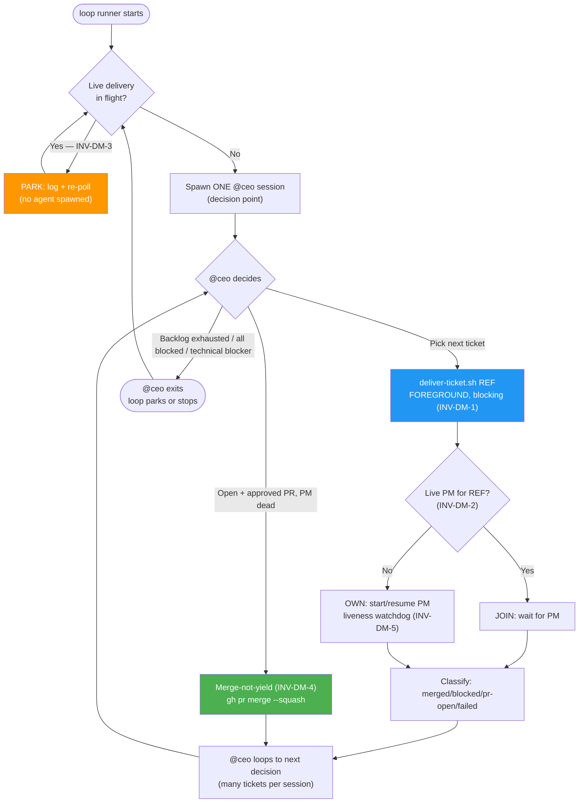
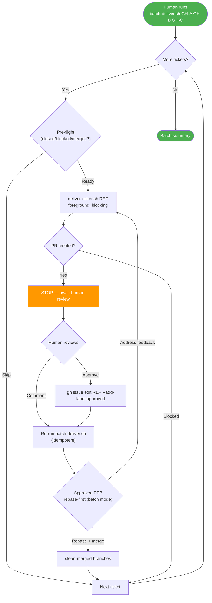

---
# Copyright (c) 2025-2026 Juliusz Ćwiąkalski (https://www.cwiakalski.com | https://www.linkedin.com/in/juliusz-cwiakalski/ | https://www.x.com/cwiakalski)
# MIT License - see LICENSE file for full terms
source: https://github.com/juliusz-cwiakalski/agentic-delivery-os/blob/main/doc/guides/delivery-modes.md
ados_distribution: redistributable
id: GUIDE-DELIVERY-MODES
status: Draft
created: 2026-07-07
owners: ["engineering"]
summary: "The two unattended delivery modes (autonomous CEO loop vs manual batch), component responsibilities, the AI-vs-script split, and the behavioral invariants that prevent the CEO-token-burn failure mode. Implements the reliability baseline for #118 (CEO upstream); absorbs #97/#99/#96."
---

# Delivery Modes

> **Status: DRAFT for review.** This document is the design spec for the
> autonomous-loop reliability baseline. It is reviewed and approved **before**
> any code. Once approved, the implementation lands as tracked work
> (ticket #142) and this note becomes canonical, cross-linked from
> [autonomous-batch-delivery.md](autonomous-batch-delivery.md) and
> [change-lifecycle.md](change-lifecycle.md).

## Why this document exists

Sustained autonomous dogfooding — a project running the **experimental,
not-yet-upstreamed CEO loop** (#118) — spawned **~20 CEO agent sessions to
deliver a single ticket**. Each session re-read a large block of CEO working
memory, re-derived *"a delivery is already in flight, do nothing,"* wrote a
large reconciliation note, and exited. Meanwhile a **detached**
`deliver-ticket.sh` did all the real work in the background. The CEO burned
tokens polling a healthy long-running script. Multiple retrospectives in the
dogfooding project flagged the same hazard across several tickets without a
fix landing.

**Root cause: the architecture was inverted.** A short-lived, expensive AI
reasoning step (the CEO opencode session) was put in charge of *babysitting*
a long-running, cheap, deterministic script (`deliver-ticket.sh`) that had
been launched **detached** (`setsid … & disown`). Every CEO exit triggered a
loop respawn; every respawn re-discovered the detached delivery and deferred.

This document fixes that by: (a) defining two clear delivery modes with
non-overlapping responsibilities, (b) stating the behavioral invariants that
make the loop converge instead of churn, and (c) aligning the fix with the
**upstream ADOS reliability plan that already designs for exactly this class
of bug** (epic #95 — #97, #99, #96).

## Origin of the tooling (so we design with the grain)

| Component | Origin | Status |
|---|---|---|
| `scripts/opencode-session.sh` | ADOS — #120, delivered in #124 | Redistributable |
| `scripts/deliver-ticket.sh` | ADOS — #124 (liveness loop generalized from the experimental CEO loop) | Redistributable |
| `scripts/batch-deliver.sh` | ADOS — #124 | Redistributable |
| `tools/clean-merged-branches` | ADOS — #121 | Redistributable |
| The generic autonomous-loop runner (#119) + `@ceo` agent (#118) | **Experimental, project-local** in dogfooding projects; **not yet in ADOS** | #118 + #119 open — this guide + #142 are the reliability baseline they need |

**Implication:** `deliver-ticket.sh` and friends are stable upstream tools;
their contract should not be bent in project-specific ways. The **loop runner
and the CEO are ours to land** (#118/#119), and the reliability fix should be
structured so it is the foundation they run on. The open issues #97/#99/#96
already design the fixes; this guide unifies them into one behavioral
contract.

## The two delivery modes

| | Mode A — Autonomous CEO loop | Mode B — Manual batch |
|---|---|---|
| **Trigger** | The loop runner (long-running outer process) | Human: `scripts/batch-deliver.sh GH-A GH-B …` |
| **Who picks tickets** | CEO agent (respects deps, priority, blockers) | Human (an explicit list) |
| **Tickets per run** | One at a time, many per CEO session | The provided list, sequentially |
| **Merge authority** | **Autonomous** — CEO merges on `approved` label / APPROVED review (user-delegated) | **Human gate** — PRs stop for review; human approves or comments |
| **Concurrency** | Exactly one ticket in flight at any time | Exactly one ticket in flight at a time (sequential) |
| **Best for** | Unattended delivery (overnight, weekend) | Curated batch with human review; addressing review feedback |
| **Backstop if a delivery outlives a session** | Loop **parks** until the in-flight delivery finishes (#97) | Human re-runs the same command (idempotent skip) |

Both modes share the same per-ticket engine (`deliver-ticket.sh`) and the same
11-phase ADOS lifecycle ([change-lifecycle.md](change-lifecycle.md)). They
differ only in *who decides* and *who merges*.

> **Batch autonomy is intentional and bounded.** In Mode B, `batch-deliver.sh`
> does **not** auto-merge (it does not pre-apply the `approved` label). The
> human merges by approving. If you want unattended merges, you are in Mode A,
> not Mode B. See [§ Open question OQ-DM-2](#open-questions).

## Component responsibilities

```
                ┌─────────────────────────────────────────────────────────┐
                │  MODE A                          MODE B                  │
                │                                                           │
   human ─────► loop runner            human ─────► batch-deliver.sh       │
                │   │ (bash, outer)                 │ (bash, sequential)   │
                │   │                               │                      │
                │   ▼ per decision point           ▼ per ticket           │
                │ @ceo (opencode, AI)              deliver-ticket.sh      │
                │   │  pick ticket / merge PR         │ (bash, foreground)  │
                │   │  handle blocker / learn         ▼                     │
                │   ▼ per ticket                    PM opencode (AI, 11ph) │
                │ deliver-ticket.sh                                        │
                │   │ (bash, FOREGROUND, blocking)                          │
                │   ▼                                                      │
                │ PM opencode (AI, 11-phase lifecycle)                     │
                │   │  → spec → plan → coder → review → … → PR             │
                │   ▼                                                      │
                │ squash-merge (gh pr merge --squash)                      │
                └─────────────────────────────────────────────────────────┘
```

| Component | Kind | Owns | Must NOT do |
|---|---|---|---|
| Loop runner (`ados-loop.sh` / `ceo-loop.sh`) | Script (outer) | Restart cadence; **park while delivery in flight**; stop signal | Spawn an agent while a delivery is alive; wipe the stop signal at startup |
| `@ceo` | AI agent (decision points) | Pick next ticket; merge ready PRs; handle blockers; retrospectives; restart a stalled delivery | Babysit a healthy delivery; detach `deliver-ticket.sh`; yield forever on a ready PR; halt merely because a peer exists |
| `batch-deliver.sh` | Script | Sequential per-ticket delivery; pre-flight skip; rebase-before-merge in batch mode; summary | Pick tickets; merge (Mode B) |
| `deliver-ticket.sh` | Script (per-ticket) | Single-ticket lifecycle: spawn/resume PM, liveness watchdog, kill-and-restart on stall, state classification, squash-merge on approval signal | Run detached; spawn a duplicate PM for the same ticket; auto-merge in Mode B |
| PM opencode | AI agent (per-ticket) | The ADOS 11-phase lifecycle; delegate to subagents; address review comments | Pick the next ticket; merge without an approval signal |
| `tools/clean-merged-branches` | Script | Branch hygiene after merges | — |

## The AI-vs-script split

The guiding principle: **the expensive, stateless, judgment-heavy work is AI;
the cheap, long-running, deterministic work is script.** The loop must never
put the expensive thing in charge of babysitting the cheap thing.

| Step | AI? | Owner |
|---|---|---|
| Pick next ticket (deps, priority, blockers) | **Yes** | `@ceo` — once per decision point |
| Detect closed / blocked / merged → skip | No | `deliver-ticket.sh` / `batch-deliver.sh` |
| Spawn & monitor PM opencode (liveness, restart) | No | `deliver-ticket.sh` |
| Run the ADOS 11-phase lifecycle | **Yes** | PM opencode + subagents |
| Review PR vs spec/plan | **Yes** | `@reviewer` (inside the PM lifecycle) |
| Approve / merge PR (autonomous, Mode A) | **Yes** (authority) | `@ceo` decision → `deliver-ticket.sh` executes `gh pr merge` |
| Rebase before merge (Mode B batch) | No | `deliver-ticket.sh` |
| Branch hygiene (fetch / prune / delete merged) | No | `tools/clean-merged-branches` |
| Handle a technical blocker | **Yes** | `@ceo` judgment |
| Retrospective / process learning | **Yes** | `@ceo` |

## Behavioral invariants (the rules that prevent the bug)

These are the non-negotiable rules. The tooling changes in
[§ What needs to change](#what-needs-to-change) exist to enforce them.

### INV-DM-1: `deliver-ticket.sh` runs FOREGROUND, never detached

A caller invoking `deliver-ticket.sh` **blocks until the ticket is merged,
blocked, PR-open, or failed.** The CEO must never `setsid … & disown` it.
This single rule removes the "CEO exits, delivery orphans, loop respawns"
failure mode at its source.

- The opencode bash-tool timeout does not violate this: if a CEO's blocking
  call is cut short, the PM child keeps running and the *next* CEO call
  **joins** it (INV-DM-2). The system converges; no work is lost.

### INV-DM-2: `deliver-ticket.sh` is single-flight + join per ticket

On startup, `deliver-ticket.sh` probes for a **live PM opencode session** for
the ticket (via the session mapping → `session_id` → process alive).

- **Live PM ⇒ JOIN:** wait for it (poll), then classify the result from
  GitHub state and exit with the same code path as if it had run. Never spawn
  a duplicate PM; never kill a healthy one.
- **No live PM ⇒ OWN:** start/resume the PM session (current behavior),
  monitor liveness, kill-and-restart on stall.

This makes `deliver-ticket.sh` **safe to call concurrently or repeatedly** —
it converges to "exactly one PM session per ticket." It is the caller's
contract: *"if a background opencode session is active for this ticket it
waits for the pid; otherwise it starts/restarts immediately."*

### INV-DM-3: The loop runner parks while a delivery is in flight

Before spawning an agent, the loop runner checks for a live
`deliver-ticket.sh` / PM opencode for **any** ticket. If one is alive, the
loop **parks** (logs "delivery in progress, waiting," re-checks on the poll
cadence) and does **not** spawn an agent. This is the #97 live-pair pre-spawn
guard. It is belt-and-suspenders behind INV-DM-1: even if an agent crashed
mid-delivery, the loop waits for the orphaned `deliver-ticket.sh` instead of
spawning a parallel agent that would race.

The stop/park signal is **durable across loop restarts** (#97): the loop does
not wipe `tmp/<loop>/stopped.txt` at startup, and a non-expired `park_until`
is honored until the park condition clears.

### INV-DM-4: CEO merges, does not yield (Mode A)

When a PR is **open + approval-authorized** for the active work item and the
PM process is **not alive**, the CEO **must** run the final-check gate and
squash-merge — regardless of any dormant peer process. "Yield" applies
**only** when a PM is demonstrably alive and mid-delivery (process exists,
no open PR). A sleeping process is not "actively delivering." This is the
#99 "merge-not-yield" + "proceed-not-halt" backstop.

### INV-DM-5: Liveness means progress, not process-alive

"Liveness" is measured by **agent progress** — git commits, worktree file
writes, `doc/changes/` artifact writes, and (#96) opencode log-step cadence.
A hung LLM stream keeps the process alive (STAT `Sl`, blocked on I/O) while
making zero progress; the ps-only heuristic must not call that "healthy." A
PM with **no log step for >`CEO_LOOP_STALL_MINUTES`** (default 15) is
**stalled**, not slow, and is killed-and-resumed.

### INV-DM-6: One ticket in flight at a time

Both modes deliver **exactly one ticket at a time.** No parallel PM sessions
on the same working tree. This preserves the ADOS discipline
([change-lifecycle.md](change-lifecycle.md)) and makes branch hygiene safe.

## Mode A — Autonomous CEO loop (corrected flow)



**Key properties of the corrected loop:**

1. **No agent is spawned while a delivery runs** (INV-DM-3). The token burn is
   gone: the loop waits in bash, not in AI.
2. **One CEO session delivers many tickets.** The CEO loops *inside* its
   session: pick → deliver (block) → classify → pick → deliver → …
3. **`deliver-ticket.sh` is always foreground** (INV-DM-1) and **join-safe**
   (INV-DM-2), so a crashed agent's orphaned delivery is adopted, not raced.
4. **A ready PR gets merged, not deferred** (INV-DM-4).

## Mode B — Manual batch (human review gate)



**Mode B rules:**

- `batch-deliver.sh` does **not** pre-apply the `approved` label. PRs stop for
  human review.
- Re-running the same command is **idempotent**: merged/closed/blocked tickets
  are skipped; an open PR with feedback is resumed and the feedback addressed.
- **Rebase before merge** in batch mode: because multiple PRs are open against
  `main`, each approved PR is rebased onto the latest `main` before
  squash-merge to avoid conflicts from a sibling merge.
- The human is the merge authority. To convert a batch to autonomous merges,
  pre-apply `approved` (or switch to Mode A).

See [autonomous-batch-delivery.md](autonomous-batch-delivery.md) for the
operational details of Mode B (the existing guide remains canonical for
`batch-deliver.sh` usage).

## Recovery semantics (why this converges)

The design is robust to the messy realities of long-running AI sessions:

| Failure | What happens | Why it converges |
|---|---|---|
| Agent crashes mid-delivery | PM child keeps running (orphaned to init). Loop sees a live delivery (INV-DM-3) and **parks**. | No duplicate agent; delivery finishes; loop resumes. |
| Agent bash-tool timeout cuts a blocking `deliver-ticket.sh` call | PM child keeps running. Next agent decision point calls `deliver-ticket.sh REF`, which **joins** (INV-DM-2). | No duplicate PM; same result returned. |
| PM LLM stream hangs | Liveness watchdog (INV-DM-5) sees no log-step progress for >stall threshold → kill-and-resume the PM via the session manager. | No infinite wait; session resumes from committed artifacts + pm-notes. |
| GitHub API rate-limit during classification | `classify_result` returns `unknown`; the iteration does not burn a restart slot (existing m-7 guard in `deliver-ticket.sh`). | Transient outage retried without losing progress. |
| Two `deliver-ticket.sh REF` invoked concurrently | Second invocation joins the first (INV-DM-2); both return the same classified result. | No race on the working tree. |

## What needs to change

> These are the tracked work items that follow from this design (ticket #142).
> The guide is reviewed first; code follows only after guide approval. Each
> item aligns with an open ADOS issue; the change is the reliability baseline
> for #118.

| # | Change | Aligns with | Files |
|---|---|---|---|
| 1 | **`deliver-ticket.sh` single-flight + join** — probe live PM by `session_id`; live ⇒ wait + classify, else own. Callers never detach. | local; precondition for #97 | `scripts/deliver-ticket.sh`, tests |
| 2 | **Loop runner delivery-gate + durable stop** — park (don't spawn an agent) while a delivery is alive; stop file survives restart; `park_until` honored. | #97 | generic loop runner (#119), tests |
| 3 | **`@ceo` prompt: never-detach + merge-not-yield + multi-ticket-per-session** — explicit invariants; loop inside the session over tickets; never `setsid … &` deliver-ticket.sh. | #99 | `.opencode/agent/ceo.md` |
| 4 | **Log-progress liveness** — `scripts/pm-liveness.sh` (opencode log-step cadence); wire into `deliver-ticket.sh` and the loop runner; retire ps-only heuristics. | #96 | new `scripts/pm-liveness.sh`, `scripts/deliver-ticket.sh`, loop runner |
| 5 | **`batch-deliver.sh` rebase-before-merge in batch mode** — when ≥1 sibling PR is open against `main`, rebase an approved PR before squash-merge. | local (Mode B) | `scripts/batch-deliver.sh`, `scripts/deliver-ticket.sh` |
| 6 | **Retire the detached-delivery pattern** from CEO working-memory conventions and retros in any project that ran the experimental loop. | local | project-local `.ai/local/**` (out of ADOS scope to edit) |

Work items 1–3 are the **minimum viable fix** for the token-burn bug and
should land together. 4 is the deeper liveness fix (#96). 5 is a Mode B
enhancement. 6 is project-local cleanup (each dogfooding project scrubs its
own working memory).

## Open questions

**OQ-DM-1 — Who calls `deliver-ticket.sh` in Mode A: the CEO (foreground,
multi-ticket-per-session) or the loop runner directly (CEO reduced to a "pick
next ticket" decision step)?**
The design above chooses the CEO-foreground model (keeps the CEO available for
mid-delivery PM questions). The alternative (loop runner owns the blocking
call; CEO only picks tickets) minimizes CEO token use further but removes the
CEO from the mid-delivery loop. **Recommendation: CEO-foreground + join
(INV-DM-2) for robustness; revisit if token cost is still too high.**

**OQ-DM-2 — Does `batch-deliver.sh` (Mode B) ever auto-merge?**
Current design: no — the human merges by approving. Confirm this is desired,
or whether a `--auto-merge` flag (pre-apply `approved`) is wanted for trusted
batches.

**OQ-DM-3 — Stall threshold tuning.**
`CEO_LOOP_STALL_MINUTES` default 15 (#96) vs the current
`DELIVER_STUCK_MINUTES=30`. Dogfooding observed that a pathologically large
opencode session DB causes legitimately-slow operations; log-progress cadence
(#96) is a better signal than wall-clock mtime and should allow tightening the
threshold safely.

**OQ-DM-4 — Issue graph.**
Confirm #142 absorbs #97/#99/#96 (close them when #142 delivers) and that the
generic loop runner (#119) lands as part of #142 (or is already tracked
elsewhere). #118 (upstream the CEO, opt-in gating, threat model, decision
record) remains the downstream consumer.

## See also

- [autonomous-batch-delivery.md](autonomous-batch-delivery.md) — canonical
  guide for `batch-deliver.sh` / `deliver-ticket.sh` / `clean-merged-branches`
  (Mode B operations, liveness loop, approval workflow, labels).
- [change-lifecycle.md](change-lifecycle.md) — the 11-phase ADOS lifecycle
  both modes wrap.
- [ados-processes.md](ados-processes.md) — the ADOS process map.
- Epic #95 (Autonomous-loop reliability): #97, #99, #96.
- Epic #117 (Loop tooling productization & safe CEO upstream): #118, #119.
- Delivery vehicle: #142.
