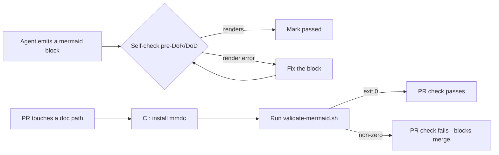

---
# Copyright (c) 2025-2026 Juliusz Ćwiąkalski (https://www.cwiakalski.com | https://www.linkedin.com/in/juliusz-cwiakalski/ | https://x.com/cwiakalski)
# MIT License - see LICENSE file for full terms
source: https://github.com/juliusz-cwiakalski/agentic-delivery-os/blob/main/doc/spec/features/feature-doc-mermaid-validation.md
ados_distribution: internal
id: SPEC-DOC-MERMAID-VALIDATION
status: Current
created: 2026-07-03
last_updated: 2026-07-03
owners: ["Juliusz Ćwiąkalski"]
service: doc-validation
summary: "The first automated guardrail over doc/**: a headless mermaid render validator, a doc-path-scoped CI gate, a diagrams rule (all Mermaid families allowed, including C4), and an authoring self-check wired into three doc-authoring agents."
links:
  related_changes: ["GH-110"]
  decisions: []
  contracts: []
---

# Feature: Doc & Mermaid Validation

## Overview

Documentation surfaces under `doc/**` historically had **no** automated quality gate: a mermaid block that failed to render could pass authoring, the inception gate, PR review, and CI, and ship undetected. This feature is the first automated guardrail over documentation renderability. It couples four deliverables — a headless mermaid **render validator** (`scripts/validate-mermaid.sh`), a dedicated **doc-path-scoped CI gate**, a **diagrams rule** (`.ai/rules/diagrams.md`), and a concise **authoring self-check** in three doc-authoring agents — so a broken diagram is caught at authoring time and at PR time. GitHub renders all Mermaid families, including C4 (verified by the owner during PR review); C4 is allowed without restriction (DEC-8).

> **Marker honesty note.** This feature spec carries `ados_distribution: internal`, but `doc/spec/**` is **outside** the GH-67 DM-2 scan set, so the marker is honest-but-unenforced and does not affect the doc-distribution guard. See [feature-doc-distribution-marker.md §63](feature-doc-distribution-marker.md) for the closed scan scope.

## Business Context

### Problem Statement

- **Problem:** No automated check inspected `doc/**` renderability; agents cannot visually "see" a broken diagram. A mermaid block that does not render passed every existing gate.
- **Affected Users:** Doc-authoring agents (`spec-writer`, `doc-syncer`, `bootstrapper`), reviewers, and any reader of architecture/decision/process docs.
- **Business Impact:** Unrenderable diagrams ship into current-truth docs; a human only discovers the break by manually rendering the page, and the defect recurs on every subsequent doc-authoring turn. A motivating incident shipped a gate-approved architecture doc whose mermaid block does not render.

### Goals & Success Metrics

- **Primary Goal:** Make `doc/**` renderability an enforced property — broken diagrams are unmergeable and detectable locally.
- **KPIs:**

| Metric | Target |
|--------|--------|
| `doc/**` paths with an automated renderability guard | 1 (was 0) |
| Validator verdict determinism on a fixed repo state | 100% reproducible |
| Failure-message completeness (file + block index + first error) | 3/3 on every failure |
| Doc-authoring agents carrying the rule + self-check | 3/3 (`spec-writer`, `doc-syncer`, `bootstrapper`) |
| Runtime dependencies added to the existing `ci.yml` | 0 (dedicated workflow) |

## User Experience & Functionality

### Capabilities

- **Render validator (F-1):** `scripts/validate-mermaid.sh` extracts every ```` ```mermaid ```` fenced block from in-scope `.md` files and renders each headless via `mmdc`; a block **passes** iff its render exits 0. A parse/render failure makes the run exit non-zero with a precise message (file + block index + first error). GitHub renders all Mermaid families, including C4 (DEC-8), so no keyword guard is applied.
- **CI gate (F-2):** `.github/workflows/docs-mermaid-validate.yml` — a dedicated, doc-path-scoped workflow (job `docs (mermaid validate)`) triggered only on `pull_request` with a `paths:` filter; it installs `@mermaid-js/mermaid-cli` and runs the validator. `ci.yml` is unchanged.
- **Diagrams rule (F-3):** `.ai/rules/diagrams.md` states that all Mermaid families are allowed (including `C4Context`/`C4Container`/`C4Component`) and are validated by the render gate; it is indexed in `.ai/rules/README.md`.
- **Authoring self-check (F-4):** A concise (1–2 line) reference to `.ai/rules/diagrams.md` plus the self-check in `spec-writer`, `doc-syncer`, and `bootstrapper` — the three doc-authoring agents whose outputs are the real mermaid surfaces today.

### User Flows



### Edge Cases & Error Handling

- **`mmdc` absent locally:** `--if-present` skips the render and the run exits 0. Without `--if-present`, an absent `mmdc` with ≥1 block exits `3` (missing-mmdc-when-required).
- **Unterminated mermaid fence:** the extractor validates what was captured (treats it as a block).
- **Non-mermaid code spans** (e.g., an example wrapped in 4 backticks): fence-length tracking prevents them fooling the extractor.
- **C4 diagrams:** allowed without restriction — GitHub renders Mermaid C4 (DEC-8); the render gate renders each block via `mmdc`.
- **`.ai/local/` scratch:** always excluded from the scan so local ephemeral state never trips a run.
- **No mermaid blocks anywhere:** exit 0 (success).

## Technical Architecture & Codebase Map

### High-Level Design

A bash validator is the core detection primitive; the CI gate is the forcing function; the rule is the authoring-time steer; the agent prompts close the authoring-time feedback loop. The render dependency (`mmdc`) is exposed as an **injectable seam** so the fast test suite stays Chromium-free and deterministic.

### Core Components & Directory Structure

| Path | Component | Responsibility |
|------|-----------|----------------|
| `scripts/validate-mermaid.sh` | Render validator (F-1) | Extract `mermaid` blocks; render each via `mmdc`; precise failure messages; `--if-present`/`--help`/`--version` |
| `scripts/.tests/test-validate-mermaid.sh` | Validator test (F-1) | `TC-MMD-001…011` subset (mocked `MMDC_CMD`, no Chromium) + mmdc-gated green baseline (`TC-BASE-001`, self-skips without `mmdc`); auto-discovered by `scripts/test-all.sh` |
| `scripts/.tests/test-docs-mermaid-workflow.sh` | Workflow structural test (F-2) | `TC-CI-003`: grep assertions (required-present + forbidden-absent) + `actionlint`/YAML-parse when available; auto-discovered by `scripts/test-all.sh` |
| `.github/workflows/docs-mermaid-validate.yml` | CI gate (F-2) | `pull_request` + `paths:` filter; `permissions: contents: read`; installs `mmdc`; runs the validator |
| `.github/workflows/ci.yml` | Existing CI (unchanged) | Not modified — the gate is a separate workflow (DEC-1) |
| `.ai/rules/diagrams.md` | Diagrams rule (F-3) | All Mermaid families allowed (incl. C4) + render gate self-check; **no** `ados_distribution` marker — outside DM-2 |
| `.ai/rules/README.md` | Rule index (F-3) | Indexes the `diagrams.md` row |
| `.opencode/agent/{spec-writer,doc-syncer,bootstrapper}.md` | Authoring self-check (F-4) | Concise rule reference + self-check before marking a doc DoR/DoD-passed |
| `.ados-claude/agent/{spec-writer,doc-syncer,bootstrapper}.md` | Generated plugin (F-4) | Regenerated via `scripts/build-claude-plugin.sh`; CI `verify-claude-build` enforces freshness |

### Key Seams & Contracts

- **`MMDC_CMD` (env, render seam):** the sole mermaid render invocation; defaults to `mmdc`. Set to a shim to mock the render (testability; keeps the fast suite Chromium-free).
- **Scan-root set (DM-2):** the union `{doc, decisions, changes, inception, .ai}` over `.md`, excluding git-ignored paths (notably `.ai/local/`). In this repo `decisions/`/`changes/`/`inception/` live under `doc/`, so `doc/**` subsumes them; the explicit roots mirror the CI `paths:` filter for robustness. Files are enumerated **sorted** (NFR-1).
- **Exit codes (DM-1):** `0` success · `2` usage error · `3` missing-mmdc-when-required · `4` render failure. Aggregate exit precedence: render (4) > missing-mmdc (3) > success (0). The missing-`mmdc` code keeps "tool not installed" separable from "tool ran and failed".
- **Failure messages:** every failure emits a human line **and** a GitHub `::error::` annotation, both carrying file path + 1-based block index + first error (3/3, NFR-4).

### Data Architecture

No persisted data. The validator treats the current repository as the **green baseline** — it passes every existing mermaid block before the gate is enabled. No existing block is re-authored.

## Non-Functional Requirements

| ID | Category | Requirement | Threshold |
|----|----------|-------------|-----------|
| NFR-1 | Determinism | Fixed repo state ⇒ fixed verdict; sorted file enumeration, no time/randomness/ordering dependence | 100% reproducible |
| NFR-2 | Performance | CI runtime — full repo doc-set validation on `ubuntu-latest` | < 120s wall-clock (**CI-only observation**; Chromium cold-start; not assertable in the local fast suite) |
| NFR-3 | Local opt-in safety | `--if-present` never hard-fails a local run on a missing tool; CI (which installs `mmdc`) is mandatory | Local without `mmdc` exits 0 with a skip notice |
| NFR-4 | Failure-message specificity | Every failure carries file path + block index + first error | 3/3 on every failure |
| NFR-5 | Render contract | A block passes iff its `mmdc` render exits 0 | Render-only; fail on parse/render error |
| NFR-6 | `bash.md` conformance | Script + test follow `.ai/rules/bash.md` | ShellCheck-clean, `shfmt -i 2 -ci -bn`; strict mode + traps; context-tagged logging; `MMDC_CMD` injection; testable main guard; documented exit codes |

## Quality Assurance Strategy

### Testing Approach

| Level | Location | Scope/Goal |
|-------|----------|------------|
| Shell integration/unit | `scripts/.tests/test-validate-mermaid.sh` | `TC-MMD-001…011` subset: broken-block failure, valid-block pass, `MMDC_CMD` injection, failure-message 3/3, determinism, exit-code distinctness — all Chromium-free via mocked `MMDC_CMD` |
| Green baseline (mmdc-gated) | `scripts/.tests/test-validate-mermaid.sh` (`TC-BASE-001`) | Validator passes the real repo doc tree; self-skips without `mmdc` so the fast suite stays green on a tool-less runner |
| Workflow structural | `scripts/.tests/test-docs-mermaid-workflow.sh` (`TC-CI-003`) | Grep assertions (required-present + forbidden-absent) + `actionlint`/YAML-parse when available; catches a malformed-workflow silent-pass |
| CI freshness | `verify-claude-build` job | `.ados-claude/` is current after the three agent-prompt edits (build invariant) |
| Inspection | workflow / rule / agents | `TC-CI-001`, `TC-RULE-001/002/003`, `TC-AGENT-001` — content greps + `ci.yml` unchanged diff |

### Critical Scenarios

- **Motivating-incident regression (TC-MMD-001):** a broken block with a fail-mock `mmdc` **must** fail — the render gate catches parse/render errors.
- **`--if-present` safety (TC-MMD-007):** a valid block passes under `--if-present` with `mmdc` absent (exit 0 + skip notice).
- **Failure-message 3/3 (TC-MMD-009):** file + block index + first error on every failure; multi-block indexing is per-block, not per-file.

## Operational & Support

### Configuration

| Var / Flag | Default | Effect |
|------------|---------|--------|
| `MMDC_CMD` | `mmdc` | Render command; set to a shim to mock |
| `MMDC_PUPPETEER_CONFIG` | unset | Optional path to a puppeteer config JSON (mmdc `-p`), e.g. for CI `--no-sandbox` |
| `VERBOSE` | unset | Set to `true` for debug output |
| `--if-present` | off | Skip the render when `mmdc` is absent |
| `-h` / `--help` | — | Usage |
| `-V` / `--version` | — | Version |

### Observability

- CI step output + GitHub `::error::` annotations on failure (file + block index + reason). No runtime metrics/logs/alerts beyond CI — this is a repo-internal build gate.

### Cost & Infrastructure

- One CI job on doc-path PRs (Chromium install + per-block render; Puppeteer/Chromium cached). Source-only PRs incur no cost — the `paths:` filter does not match. `ci.yml` is unchanged (DEC-1).
- **Drift management:** pin the `mmdc` version. The script's scan-root set (DM-2) and the CI `paths:` filter must stay aligned — future doc-tree layout changes require updating both.

## Dependencies & Risks

- **Depends on:** `@mermaid-js/mermaid-cli` (`mmdc`) — external npm package; pulls `puppeteer` + Chromium (transitive).
- **Depends on:** `.ai/rules/bash.md` (script + test standard); `scripts/test-all.sh` (auto-discovery); `scripts/build-claude-plugin.sh` (`.ados-claude/` regen for agent edits).
- **Non-goals (deferred):** markdownlint config + job; re-rendering diagrams to committed image assets; redistributing the validator or the rule to adopters.

| Risk | Mitigation |
|------|------------|
| **Render flakiness** — `mmdc`/puppeteer/Chromium heavy/cold-start (CI runtime) | Dedicated, doc-path-scoped job isolated from `ci.yml`; cache the Chromium install |
| `--if-present` local ambiguity — agents skip local validation, a broken block ships | CI is the hard gate (always installs `mmdc`); the agent self-check references the render gate |
| `.ados-claude/` regen drift — editing agent prompts without regenerating | Regenerate + commit source + generated together; CI `verify-claude-build` enforces freshness |

## Glossary & References

- **`mmdc`** — `@mermaid-js/mermaid-cli`, the headless Mermaid renderer (CLI); pulls `puppeteer` + Chromium.
- **C4** — Mermaid C4 diagrams (`C4Context`/`C4Container`/`C4Component`); GitHub renders them, so they are allowed without restriction (DEC-8).
- **`--if-present`** — validator mode that skips the render (exit 0) when `mmdc` is absent; CI is mandatory.
- **Green baseline** — the current repo state, on which the validator passes before the gate is enabled.

### Related Documentation

- **Delivering change:** GH-110 (this feature; DEC-8 = C4 allowed, render-only contract).
- **Rule:** [.ai/rules/diagrams.md](../../../.ai/rules/diagrams.md).
- **Validator:** [scripts/validate-mermaid.sh](../../../scripts/validate-mermaid.sh); tests: [test-validate-mermaid.sh](../../../scripts/.tests/test-validate-mermaid.sh), [test-docs-mermaid-workflow.sh](../../../scripts/.tests/test-docs-mermaid-workflow.sh).
- **Sibling spec (DM-2 scope):** [feature-doc-distribution-marker.md](feature-doc-distribution-marker.md) — confirms `doc/spec/**` is outside the marker/guard scan set.
- **Sibling spec (gates neighborhood):** [feature-quality-gates-and-pr.md](feature-quality-gates-and-pr.md) — the verification-and-release gates this doc-renderability gate complements.
